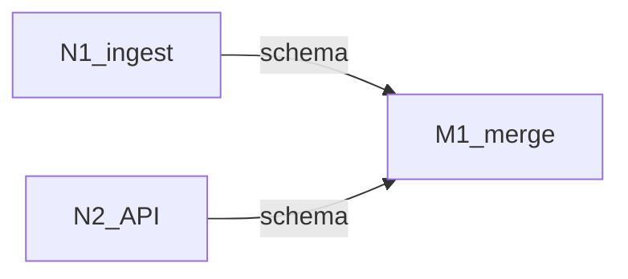

# Execution graph

> **This is the plan you read.** Node plans are separate files; every one
> must appear as a markdown link in [Node plans](#node-plans).
>
> Fill this shape in nawab **§19** and write it to `EXECUTION_GRAPH.md`.
> On approval, **run immediately**.

---

## Metadata

| Field | Value |
|-------|-------|
| **Scope plan** | [IMPLEMENTATION_PLAN.md](IMPLEMENTATION_PLAN.md) (nawab §0–§18) |
| **Objective** | [one sentence] |
| **Topology mix** | chain / diamond / pipeline / conditional / cycle / mix |
| **Depth** | 2 (graph → node plans). No nested graphs unless re-invoked. |
| **Graph-engineering** | named — approving this graph starts execution |

---

## Node plans

**Required.** Every node has a row. Links must resolve (write the files
before asking for approval).

| ID | Name | Plan |
|----|------|------|
| N1 | ingest core | [plans/nodes/N1.md](plans/nodes/N1.md) |
| N2 | API | [plans/nodes/N2.md](plans/nodes/N2.md) |
| M1 | merge / harden | [plans/nodes/M1.md](plans/nodes/M1.md) |

Default directory: `plans/nodes/<id>.md` next to `EXECUTION_GRAPH.md`.

---

## Lifecycle

Every full one-shot lists these stages. `N/A` needs a reason. See
`.cursor/skills/graph-engineering/LIFECYCLE.md`.

| Stage | Node id(s) | Plan / N/A |
|-------|------------|------------|
| Research + questions | R0 | lead (Gate 0 done) |
| Docs-in | D0 | [plans/nodes/D0.md](plans/nodes/D0.md) |
| Architecture | A1 | [plans/nodes/A1.md](plans/nodes/A1.md) |
| Design / UI UX | U1 | [plans/nodes/U1.md](plans/nodes/U1.md) or `N/A — …` |
| Build | B* | links |
| Integrate | M1 | [plans/nodes/M1.md](plans/nodes/M1.md) |
| Evaluate | E1 | [plans/nodes/E1.md](plans/nodes/E1.md) |
| Run | R1 | [plans/nodes/R1.md](plans/nodes/R1.md) |
| Trials | T1 | [plans/nodes/T1.md](plans/nodes/T1.md) |
| Docs-out | D1 | [plans/nodes/D1.md](plans/nodes/D1.md) |

---

## Mermaid

Draw **only real edges**. Independent nodes have no arrow between them.

---

## Nodes

| ID | Job | Plan | Input schema | Output schema | Type | Model | Write paths |
|----|-----|------|--------------|---------------|------|-------|-------------|
| N1 | … | [N1](plans/nodes/N1.md) | `{ … }` | `{ … }` | generalPurpose | inherit | `packages/ingest/**` |

Rules:

- One job per node. The node agent loads **its plan only**.
- Inputs passed explicitly.
- Cheap = extract/classify (`composer-2.5-fast`). Merge/judge = `inherit`.
- Parallel writers: disjoint write paths.

---

## Edges

| From | To | Data name | Kind |
|------|----|-----------|------|
| N1 | M1 | `schema` | plumbing / agent / verify |

- **plumbing** — lead code. No Task, no node plan.
- **agent** — judgment. The downstream **node plan** consumes the artifact.
- **verify** — must survive a checker before it may flow on.

If you cannot name the data, there is no edge. Cut it.

---

## Waves

| Wave | Nodes | Fan-out? | Barrier? | Status | Lead plumbing |
|------|-------|----------|----------|--------|---------------|
| 0 | [N1](plans/nodes/N1.md), [N2](plans/nodes/N2.md) | yes | no | pending | — |
| 1 | [M1](plans/nodes/M1.md) | no | yes — whole set | pending | `flatMap` + dedupe |

`Status` is the checkpoint: `pending` / `running` / `done` / `partial`.
Resume at the first non-`done` wave.

---

## Failure

- Task throw/empty → **null**, drop, continue the wave.
- Fan-in tolerates missing inputs.
- Cycle `seen` keys: `[formula]`. Dedupe against **seen**, not only confirmed.
- Dry stop: **2** consecutive rounds with no fresh keys.

---

## Commit mapping

| Node | Plan | §9 rows | Gate |
|------|------|---------|------|
| N1 | [N1](plans/nodes/N1.md) | #–# | `[command]` |

Lead commits. Ponytail on every write. One matrix row per commit.

---

## Approval implication

Approving **this graph** (nawab plan with §19 filled) starts graph execution
immediately. Node plans are already written and linked. No second wait, and
no wait per node unless a node plan marks a human checkpoint (prod / freeze).
