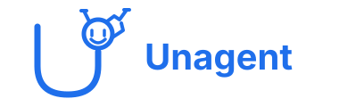
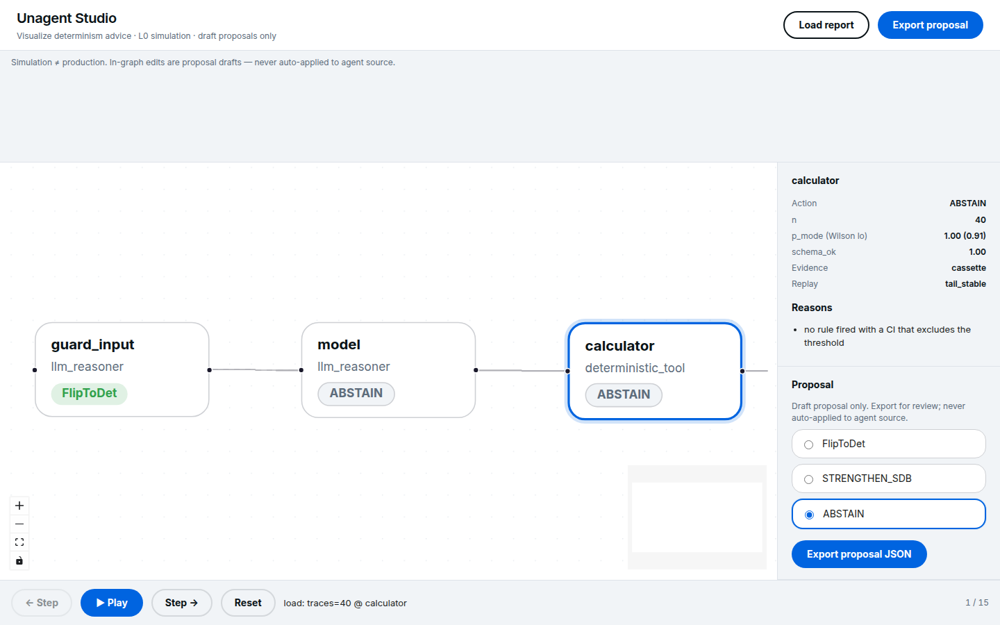
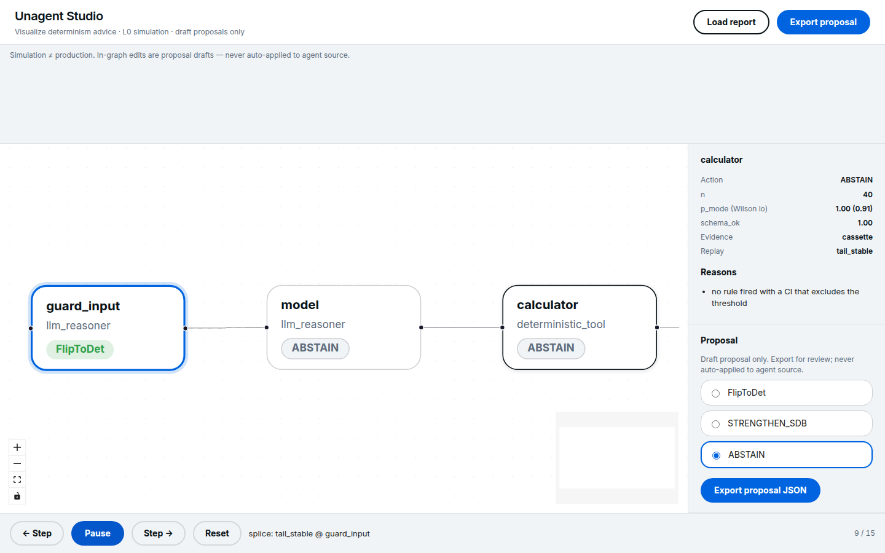

<div align="center">
  
</div>

<p align="center">
  <a href="docs/README.md"></a>
  <a href="LICENSE"></a>
  <a href="pyproject.toml"></a>
  <a href="https://github.com/Vinayak-RZ/unagent"></a>
</p>

<p align="center">
  <a href="docs/README.md"><b>Docs</b></a> ·
  <a href="CONTRIBUTING.md"><b>Contributing</b></a> ·
  <a href="LICENSE"><b>License</b></a>
</p>

> Full internals (every package, file map, how the repo runs): [Extensive README](docs/EXTENSIVE.md)

**Unagent** is a design-time advisor for agentic architectures. You give it production traces. It reconstructs the agent as a graph, asks a counterfactual that eval platforms do not ask — *should this node be a function or a model?* — and either recommends a determinism-class flip with evidence, or **ABSTAINs**.

The GitHub repository is [`Vinayak-RZ/unagent`](https://github.com/Vinayak-RZ/unagent). You still `pip install` / `import` **`superdeterminism`**. Product name: Unagent. Capability: Determinism Advisor.

> **Unagent is an offline OSS CLI and Python library you can run today.** It is not a hosted eval platform, a workflow searcher, or a LangChain-only plugin.
> Primary interface: `python -m superdeterminism recommend`. It never auto-applies a refactor. **Simulation ≠ production.**


## Viral quickstart

```bash
pip install -e .
python -m superdeterminism recommend examples/advisor_flip_to_det.json --stdout narrative
python -m superdeterminism simulate examples/advisor_flip_to_det.json --mode what-if --node classify
python -m superdeterminism recommend tests/fixtures/sinks/langfuse_export.json --sink langfuse --stdout json
```

Unagent reconstructs your agent graph from traces, **simulates** determinism-class flips, and either recommends a change or **ABSTAINs**. Simulation ≠ production.

## See it in Studio

End-to-end run against a real LangGraph topology (mirror of [JoshuaC215/agent-service-toolkit](https://github.com/JoshuaC215/agent-service-toolkit) `research_assistant`): harness emits 40 traces → `studio-report` → Unagent Studio.

Architecture graph — `guard_input` certified **FlipToDet**; `model` and `calculator` **ABSTAIN**:



L0 simulation playback (cassette splice on `guard_input`):



<video src="docs/assets/e2e/studio_simulation_playback.mp4" controls width="720"></video>

Full write-up (method, recommendations, how to improve that architecture): [docs/reports/E2E_LANGGRAPH_STUDIO.md](docs/reports/E2E_LANGGRAPH_STUDIO.md). Regen: [demos/e2e-langgraph/](demos/e2e-langgraph/).

## See it running

One recorded `classify` span can look perfectly stable (`p_mode` 1.00) and even pass an L0 cassette splice. With `n=1` the advisor still **ABSTAINs**: the [Wilson](https://en.wikipedia.org/wiki/Binomial_proportion_confidence_interval) lower bound is 0.21, so a flip is not justified.

```text
$ python -m superdeterminism recommend examples/advisor_stable_llm.json --n-min 1 --stdout json
{
  "disclaimer": "simulation != production; canary is confirmatory",
  "report_version": "1.0",
  "estimator": "l0_tape_splice",
  "evidence_ceiling": "cassette",
  "recommendations": [
    {
      "node_id": "classify",
      "action": "ABSTAIN",
      "n": 1,
      "p_mode": 1.0,
      "p_mode_lower": 0.2065,
      "schema_ok": 1.0,
      "evidence_tier": "cassette",
      "replay_status": "tail_stable",
      "reasons": [
        "p_mode point 1.00 meets threshold but wilson_lower 0.21 does not"
      ]
    }
  ]
}
```

<em>Notice two things that most “agent advisors” hide. Cassette-stable is not enough. A point estimate of 100% is not enough. ABSTAIN is a first-class product result.</em>

Forty independent traces of the same schema-stable classify node *do* certify a flip — still as an estimate, still with a canary checklist, still without touching your `graph.py`:

```text
$ python -m superdeterminism recommend examples/advisor_flip_to_det.json --stdout json
```

```text
"action": "FlipToDet",
"n": 40,
"p_mode": 1.0,
"p_mode_lower": 0.9124,
"evidence_tier": "cassette",
"replay_status": "tail_stable",
"deltas": [
  "auditability: llm logs -> deterministic function",
  "cost_tokens estimated -80.0 per call",
  "latency_ms estimated -200.0 model wait"
]
```

<em>FlipToDet is allowed only when schema, mode, Wilson, L0 tail-stability, and a metric improvement all fire. Task success stays `null` unless you supplied `advisor.outcome.success` — we refuse to pretend `span.error` is the product outcome.</em>

## Why it exists

Teams guess whether a step should be a typed tool or an LLM/subagent. Eval tools score the path you already ran. Architecture-search papers invent new graphs offline. Neither flips **determinism class** on an ingested production graph.

The unclaimed layer is that re-typing — not “nobody does counterfactual agent simulation.” [CAR](https://arxiv.org/abs/2606.08275), CausalFlow, Tracefork, AgentReplay, and counterfact already intervene on traces. Unagent asks a different question: *should this node be a function or a model?*

## Ideas you will learn

These are the ideas the code is built from. After this section you should be able to argue with an eval vendor, an architecture-search paper, and a “just set temperature to 0” comment using the same vocabulary.

### Determinism class is a type, not a prompt

In 2026 most agent stacks still treat “use a tool” vs “ask the model” as a *generation-time* choice (decode the next token, maybe emit a function call). Unagent treats it as an **architecture type** on a node: `det.class ∈ {deterministic, llm, llm_seeded, …}`. A flip changes the type. The name stays. The wiring changes by hand.

Nearby-wrong: [WHEN2TOOL](https://arxiv.org/abs/2605.09252) asks whether a tool call is *necessary this turn*. Useful. Different job. We output “refactor node X from `llm_reasoner` to a function,” not “steer this decode.”

### Seeing a trace is not intervening on it

Judea Pearl’s [ladder of causation](https://en.wikipedia.org/wiki/Causal_model#Ladder_of_causation) has three rungs: association (“what usually co-occurs”), intervention (“what if we *do* this”), counterfactuals (“what would *this* incident have been”). Most LLM eval is rung 1 with a leaderboard. Unagent estimates a **rung-2 policy intervention** (`do` the node’s mechanism). It does **not** claim rung 3 (“this exact refund would have been avoided”).

**Read next.** [Pearl’s three-layer hierarchy (UCLA)](https://web.cs.ucla.edu/~kaoru/3-layer-causal-hierarchy.pdf) — association vs `do(·)` vs unit-level counterfactuals.

### `do_policy` and the point of commitment

[Causal Agent Replay](https://arxiv.org/abs/2606.08275) showed the obvious heuristic is wrong: the span that *executes* the harm is often not the span that *decided* it. The intervention unit is the decision mechanism. Unagent inherits that: FlipToDet targets a **commitment node**, not `issue_refund` because the name looks guilty. CAR attributes *failure*. We re-type *class*. Same algebra, different question.

### Observational evidence cannot certify a flip

Pooling historical outputs (`p_mode`, schema rate) is labeled `observational_l0_proxy`. It is a diagnostic. The lowest tier that may emit FlipToDet is a **cassette**: a hash-verified L0 tape splice whose tail stays stable. Tiers above that (live L1 fork, production-confirmed canary) are explicit and off by default.

That is the 2026 hygiene rule this repo exists to enforce. Trace-driven auto-promotion of playbooks is a neighbor ([Progressive Crystallization](https://arxiv.org/abs/2607.07052)); we do **not** claim that. Searching a *new* LLM/tool workflow from history is another neighbor ([FlowScout](https://arxiv.org/abs/2608.10039)); we re-type the graph you already ran.

### Replay is not resample

Serving the same bytes from a cassette is **replay**. Drawing a new completion from the same prompt is **resample**. [SymTrace](https://arxiv.org/abs/2608.25920) made that distinction load-bearing for failure debugging. Unagent reports `replay_status` (`tail_stable`, `diverged`, `refused_mutating`, `resample_only`) so a JSON consumer cannot confuse the two. LangGraph [time-travel](https://docs.langchain.com/oss/python/langgraph/use-time-travel) is checkpoint-restart: nodes re-execute, LLM calls fire again. That is not a VCR.

### Wilson intervals, and why ABSTAIN is a feature

`p_mode = 1.0` on one trace is a coin that came up heads. The [Wilson score interval](https://en.wikipedia.org/wiki/Binomial_proportion_confidence_interval) is the interval you want for a binomial proportion when `n` is small or `p` is near 0 or 1 — it does not collapse to a zero-width lie the way a naive Wald interval does. Default `n_min=30`. If the lower bound does not clear 0.70, we **ABSTAIN**.

A product that cannot say “I don’t know” will eventually ship architecture advice from a fixture.

### Temperature 0 is not a seed

Hosted greedy decoding is still load-dependent. Thinking Machines measured 80 unique completions in 1,000 temperature-0 runs. Unagent will never promise bit-exact architecture advice from a single replay.

**Read next.** [Defeating Nondeterminism in LLM Inference](https://thinkingmachines.ai/blog/defeating-nondeterminism-in-llm-inference/) — batch invariance, not “just set temp=0.”

### Outcome vectors, not a quality score

A flip that saves tokens but worsens policy is not a win. The report keeps **separate** metrics: failure, cost, latency, variance (`p_mode`), auditability, optional task success / policy compliance. We do not collapse them into one “agent score.” Task success is user-supplied (`advisor.outcome.success` or `--outcome-attr`) or explicitly `null`.

If the apparent gain lives in one model/prompt cell, we abstain ([RouteGuard](https://arxiv.org/abs/2608.07583)-shaped: do not certify a routing win from a thin workload cluster).

### OpenTelemetry GenAI is Development — pin a commit

Traces arrive as OTLP. The conventions live in [`semantic-conventions-genai`](https://github.com/open-telemetry/semantic-conventions-genai) and are **Status: Development**. Core OTel [v1.42.0](https://github.com/open-telemetry/semantic-conventions/releases/tag/v1.42.0) moved `gen_ai.*` out of the tagged core. We pin commit `c739977ae690961f36e435504e5c1febaef1f7f3` (2026-07-30). Advisor fields live in `advisor.*` / `det.*`. We never invent `gen_ai.*` keys.

### Fail-closed engineering

Unknown ops, mixed kinds on one `node_id`, 100% failing LLMs, low graph trust, tampered tapes, and mutating-tool misses do not get a lucky FlipToDet. Sensitive names (`refund`, `auth`, `pii`, …) **STRENGTHEN** a deterministic gate rather than “just add an LLM.” Scaffold writes under `--out` and never patches your source. Core has **zero** LangChain import; adapters translate.

That last sentence is how you keep CrewAI / MAF / house JSON honest later: one recommender, many mappers.

## Core techniques

- **Determinism-class flip.** Re-type a node between deterministic tool and stochastic LLM/subagent (`FlipToDet` / `FlipToNondet` / `STRENGTHEN_SDB` / `ABSTAIN`) on the graph reconstructed from traces. Policy: [`src/superdeterminism/pipeline.py`](src/superdeterminism/pipeline.py). Contract: [docs/methodology.md](docs/methodology.md). Limit: a recommendation is an estimate; a canary with the same outcome vector is confirmatory.
- **L0 hash-verified cassette.** Build a tape, verify SHA-256, splice a majority/schema stand-in, stop on first miss. Mutating tools without a cassette hit **refuse**. Related: CAR `do_policy`; Tracefork / AgentReplay cassettes. Limit: L0 is invalid once the next call-site misses the tape.
- **First-class ABSTAIN.** `n_min=30`, Wilson lower bound, evidence-tier ceiling. Weak evidence is not a quieter flip.
- **Agnostic core + adapters.** Stdlib runtime. `--adapter langgraph` is an extra. `--adapter custom` and `--adapter atif` are extras-free proofs. [LangChain `create_agent`](https://docs.langchain.com/oss/python/langchain/agents) is the P1 graph shape. Limit: Langfuse / MLflow / CrewAI / MAF live sinks are specified, not built ([docs/p2-ecosystem.md](docs/p2-ecosystem.md)).

## The idea

Think of each agent step as having a **type**: function or model. Unagent does not ask “did this run succeed?” It asks “if we changed the type, would the outcome vector get better?” — then recommends that change or refuses to guess.

Analogy: a compiler does not score yesterday’s binary; it re-types an expression when the evidence says the cheaper form is equivalent. The invariant: **simulation ≠ production**.

## How it works

```mermaid
flowchart LR
  traces[Trace files] --> ingest[Strict ingest]
  ingest --> graph[Architecture graph]
  ingest --> tape[Hash-verified tape]
  graph --> evidence[Stratified evidence]
  tape --> replay[L0 splice]
  replay --> evidence
  evidence --> policy[Fail-closed policy]
  policy --> report[Report v1]
  report --> scaffold[Manual scaffold]
```

`scaffold` writes `REPORT.md`, `WIRING.md`, `CANARY.md`, and illustrative `patches/*.diff`. It does **not** edit `graph.py`. Details: [docs/architecture.md](docs/architecture.md), [docs/usage.md](docs/usage.md).

## Get started

You need **Python 3.10+**. No API key for the advisor; it reads traces you already have.

```bash
pip install -e ".[dev]"
python -m superdeterminism recommend examples/advisor_stable_llm.json --n-min 1 --stdout json
python -m superdeterminism recommend examples/advisor_flip_to_det.json --stdout json
python -m superdeterminism validate examples/advisor_stable_llm.json
python -m superdeterminism inspect examples/advisor_stable_llm.json
```

LangGraph ingest (optional extra):

```bash
pip install -e ".[dev,langgraph]"
python -m superdeterminism recommend traces.json --adapter langgraph --stdout json
python -m superdeterminism scaffold report.json --out scaffold/RUN
```

Agents: always `--stdout json`. Humans can add `--md report.md`. Full flags: [docs/usage.md](docs/usage.md).

## Go deeper

| Topic | Doc |
|-------|-----|
| Internals, file map, engineering bets | [docs/EXTENSIVE.md](docs/EXTENSIVE.md) |
| Product brief | [docs/overview.md](docs/overview.md) |
| Claim hygiene | [docs/landscape.md](docs/landscape.md) |
| How a flip is estimated | [docs/methodology.md](docs/methodology.md) |
| OTel ingest | [docs/ingestion.md](docs/ingestion.md) |
| Domain graph | [docs/architecture.md](docs/architecture.md) |
| CLI | [docs/usage.md](docs/usage.md) |
| P1 LangGraph | [docs/p1-langgraph.md](docs/p1-langgraph.md) |
| P2 (specified) | [docs/p2-ecosystem.md](docs/p2-ecosystem.md) |
| Agent instructions | [AGENTS.md](AGENTS.md) |

## Repo layout

```text
src/superdeterminism/   Agnostic core + adapters
tests/                  Contract, negative, planted-truth tests
examples/               ABSTAIN + FlipToDet demos
schemas/                report-v1, tape-v1
docs/                   Research contract + EXTENSIVE.md
.cursor/                Vendored coding config
```

## Community

Issues and PRs: [CONTRIBUTING.md](CONTRIBUTING.md). Read [AGENTS.md](AGENTS.md) before changing decision rules. Decision log: [DECISIONS.md](DECISIONS.md).

## Acknowledgements

- [OpenTelemetry GenAI semantic conventions](https://github.com/open-telemetry/semantic-conventions-genai) — ingest interchange (Development; pin a commit, not a tag)
- [LangChain / LangGraph](https://docs.langchain.com/oss/python/langchain/agents) — P1 adapter maps `create_agent` and `StateGraph`; core does not import them
- [Causal Agent Replay](https://arxiv.org/abs/2606.08275) — `do_policy` / point-of-commitment; we do not claim CAR’s attribution layer
- [Thinking Machines Lab](https://thinkingmachines.ai/blog/defeating-nondeterminism-in-llm-inference/) — residual nondeterminism of hosted greedy decoding
- [Pearl, *Causality*](https://doi.org/10.1017/CBO9780511803161) — intervention vs observation; we estimate `do`, we do not claim unit-level counterfactuals

## License

Apache License 2.0. See [LICENSE](LICENSE).
