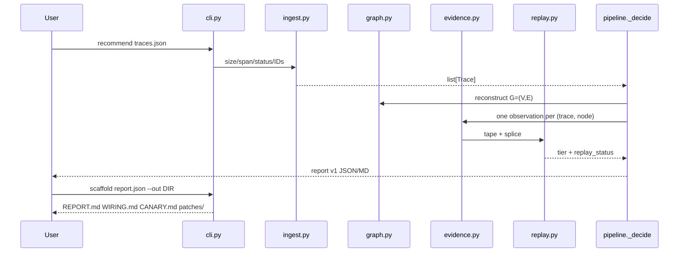

# Unagent — extensive internals

Companion to the main [README](../README.md). How the repo runs, every first-party module, why files exist, and the ideology behind the engineering. Paths below exist in the tree. Do not treat planted-fixture top-lines as product accuracy.

## Table of contents

- [1. How this repository runs](#1-how-this-repository-runs)
- [2. Package map](#2-package-map)
- [3. Packages](#3-packages)
- [4. Configuration](#4-configuration)
- [5. Tests and CI](#5-tests-and-ci)
- [6. Ideas worth understanding](#6-ideas-worth-understanding)
- [7. Further reading](#7-further-reading)
- [8. Future advancements](#8-future-advancements)

## 1. How this repository runs

CLI against untrusted JSON. Optional `validate` / `inspect`. `recommend` reconstructs a graph, builds a hash-verified L0 cassette, and fail-closes to ABSTAIN unless a cassette-stable flip is certified. `scaffold` writes under `--out` only.



```text
traces.json → ingest → classify → graph → evidence → L0 splice → _decide → JSON/MD
report.json → scaffold → REPORT.md WIRING.md generated/ patches/ CANARY.md
```

Installable name: `superdeterminism`. Product name: Unagent. Entry: `python -m superdeterminism` (`src/superdeterminism/__main__.py` → `cli.main`).

## 2. Package map

| Package | Path | Role | Entry |
|---------|------|------|-------|
| `superdeterminism` | `src/superdeterminism/` | Agnostic advisor core | `python -m superdeterminism` |
| adapters | `src/superdeterminism/adapters/` | Optional mappers | `--adapter langgraph\|custom\|atif` |
| tests | `tests/` | Contract + negative + planted | `python -m pytest -q` |
| examples | `examples/` | ABSTAIN + FlipToDet demos | CLI paths in `examples/README.md` |
| schemas | `schemas/` | report-v1, tape-v1 | loaded by humans/CI, not required at runtime |
| benchmarks | `benchmarks/planted/` | Planted DET traces | not a marketing accuracy number |
| docs | `docs/` | Research contract | start at `docs/README.md` |

Generated noise (not listed further): `__pycache__/`, `.pytest_cache/`, `src/superdeterminism.egg-info/`. Vendored coding config: `.cursor/` — one line, not a file dump.

## 3. Packages

### 3.1 `superdeterminism` (`src/superdeterminism/`)

**What it is for.** Offline determinism-class advice on ingested traces. Stdlib-only runtime. No live LLM. No auto-apply.

**How it is used.** `python -m superdeterminism recommend|validate|inspect|scaffold`. Library: `from superdeterminism.pipeline import recommend_traces`.

**How it works.** `cli.py` is a thin boundary. `pipeline.recommend_traces` is the facade: reconstruct → collect stats → attach L0 replay → fail-closed `_decide` → versioned report dict. Adapters must emit core `Trace`s; they must not contain recommendation logic.

#### File map

| File | Why it is here | What it does |
|------|----------------|--------------|
| `__init__.py` | Public library surface | Re-exports `Span`, `Trace`, `recommend_traces` |
| `__main__.py` | `python -m` entry | Calls `cli.main` |
| `models.py` | One source of truth for contracts | Enums + frozen dataclasses; schema/report/tape versions `1.0` |
| `ingest.py` | Untrusted-file trust boundary | OTLP/flat parse, size/span/depth limits, real status, outcome attrs |
| `classify.py` | Span is not a graph node | Maps ops/names → `node_kind` + `det.class` (router/handoff included) |
| `graph.py` | Methodology assumes G=(V,E) | Parent/control/handoff edges, completeness, trust, commitment ids |
| `evidence.py` | Last-write pooling is a bug | Trace as sampling unit, Wilson, mixed-workload flag, evidence tiers |
| `replay.py` | L0 must be a cassette, not a vibe | Hash-verified tape, splice, tamper, mutating refuse |
| `pipeline.py` | One policy, many callers | `_decide`, report/markdown, inspect, bounded AND hypotheses |
| `cli.py` | Agent-friendly process | argparse, exit 2 on boundary errors, `--traces-dir`, `--outcome-attr` |
| `scaffold.py` | No auto-apply (ADR 0003) | Atomic writes, wipe stale `patches/*.diff`, CANARY.md |

### 3.2 adapters (`src/superdeterminism/adapters/`)

**What it is for.** Translate producer JSON into core `Trace`s. Recommendation logic stays in core.

**How it is used.** `--adapter NAME`. Registry in `__init__.py` checks extras with `importlib.util.find_spec` before import.

**How it works.** `Protocol` is `from typing import Protocol` (Python 3.14 rejected `collections.abc.Protocol` here). LangGraph mapper is attribute-only: it does not `import langchain`.

#### File map

| File | Why it is here | What it does |
|------|----------------|--------------|
| `adapters/__init__.py` | Lazy registry | `resolve("langgraph"\|"custom"\|"atif")` |
| `adapters/langgraph.py` | P1 without core lock-in | Drop `__start__`/`tools` envelopes; retriever/Azure quirks |
| `adapters/custom.py` | Pluggability proof | House `{traces}` or `{events}` |
| `adapters/atif.py` | Non-Lang path | ATIF-shaped trajectory → spans |

### 3.3 tests (`tests/`)

**What it is for.** Pin fail-closed behavior. A green suite that recommends FlipToDet on unknown nodes is a product bug.

**How it is used.** `python -m pytest -q` (extras-free). LangGraph extra tests live under `tests/adapters/` and skip or fail closed when extras are missing.

#### File map

| File | Why it is here | What it does |
|------|----------------|--------------|
| `test_pipeline.py` | Policy matrix | FlipToDet, ABSTAIN, STRENGTHEN_SDB, mixed-kind order, mixed workload |
| `test_ingest.py` | Trust boundary | OTLP status, `error: "false"`, size limit, validate/inspect CLI |
| `test_graph.py` | Reconstruction goldens | Parent/control/handoff, commitment vs side-effect, low completeness |
| `test_replay.py` | Cassette integrity | Tamper, stable splice, diverge, mutating miss |
| `test_cli_hardening.py` | Product UX hazards | Stale patch wipe, malformed exit 2 |
| `test_adapters_extra.py` | P2-shaped pluggability | custom + ATIF without extras |
| `test_cli.py` | Pre-hardening CLI | Still gates recommend/scaffold happy path |
| `test_import_hygiene.py` | Agnostic-core invariant | No langchain/langgraph import outside `adapters/langgraph.py` |
| `adapters/test_*.py` | P1 mapper | create_agent / StateGraph fixtures, registry extras |
| `fixtures/`, `adapters/fixtures/` | Planted producers | Stable LLM, OTLP quirks |

### 3.4 examples, schemas, benchmarks, docs

| Path | Why it is here |
|------|----------------|
| `examples/advisor_stable_llm.json` | Teach ABSTAIN at `n=1` |
| `examples/advisor_flip_to_det.json` | 40 traces; cassette FlipToDet at default `n_min` |
| `examples/custom_adapter.py` | Copy-paste house mapper |
| `schemas/report-v1.json` | Report contract for agents |
| `schemas/tape-v1.json` | Cassette record shape |
| `benchmarks/planted/det_vs_open.json` | Planted truth, not a published accuracy |
| `docs/*.md` | Claim hygiene, methodology, usage — start at [docs/README.md](README.md) |
| `.github/workflows/ci.yml` | 3.10–3.14 Ubuntu+Windows + wheel job |
| `scripts/validate.ps1` | Local orchestrator (pytest, import hygiene, schemas, CLI help) |

## 4. Configuration

Runtime: **no required env vars**, no API keys, no network. Optional extra `langgraph` in `pyproject.toml`. Outcome success is a span attribute or `--outcome-attr`, never inferred from `span.error`.

OTel pin: commit `c739977ae690961f36e435504e5c1febaef1f7f3` — [docs/ingestion.md](ingestion.md), ADR [0007](decisions/0007-otel-pin.md).

## 5. Tests and CI

```bash
pip install -e ".[dev]"
python -m pytest -q
powershell -File scripts/validate.ps1
```

CI: `.github/workflows/ci.yml` — extras-free pytest on Python 3.10–3.14, Ubuntu and Windows; separate Ubuntu wheel install + `python -m superdeterminism --help`. macOS is deferred.

Import hygiene is a test **and** a validate.ps1 step: core must not import LangChain.

## 6. Ideas worth understanding

This section is the engineering ideology. The product README teaches the field; this file teaches why the *code* looks like this.

### Fail closed, or you will ship a fixture

The original prototype could FlipToDet a 100% failing or unknown node because `p_mode` on pooled last-write spans looked confident. That is not laziness in the small-diff sense; it is a causal claim with no warrant. `_decide` puts ABSTAIN / STRENGTHEN_SDB first. Compatibility with old tests lost: FlipToNondet of a failing DET node now waits for L1.

### Trace is the sampling unit

Forty copies of one span inside a single `Trace` is **n=1**. Independent runs are independent traces. Mixed `node_kind` on the same id is a set, not last-write-wins. Order of traces must not change the action.

### Cassette vs resample

A tape whose SHA-256 matches is replay. Majority-vote pooling without a stable splice is observational / `resample_only`. Reports expose both `estimator` and `replay_status` so an agent consumer cannot launder one into the other.

### Stdlib core, adapters at the edge

P2 (CrewAI, MAF, house JSON) is only honest if P0 never imported LangChain. The LangGraph file is allowed to *rewrite attributes*; `resolve()` checks extras first. `Protocol` from `typing` because 3.14.

### Untrusted files, trusted policy

Ingest caps bytes and span count, unwraps OTLP status, treats `error: "false"` as success. Scaffold is write-only under `--out`, wipes stale diffs, escapes Markdown. Replay never invokes live tools; mutating misses refuse.

### Pins, not `main`

GenAI semantic conventions are Development. Following `main` silently is how you double-count tokens and invent keys. Pin a commit. Coalesce aliases. Never emit new `gen_ai.*`.

### Bounded hypotheses, not search

Adjacent failing nodes may be tagged `AND? a+b` (GCJR-shaped families). The engine does not search a new workflow (that is FlowScout) and does not auto-promote a playbook (that is Progressive Crystallization).

## 7. Further reading

| Idea | Link | What you will learn |
|------|------|---------------------|
| Ladder of causation | [Wikipedia: causal model](https://en.wikipedia.org/wiki/Causal_model#Ladder_of_causation) | Association vs intervention vs counterfactual |
| Pearl hierarchy | [UCLA 3-layer PDF](https://web.cs.ucla.edu/~kaoru/3-layer-causal-hierarchy.pdf) | Why eval-on-logs cannot answer `do(·)` |
| CAR | [arXiv:2606.08275](https://arxiv.org/abs/2606.08275) | `do_policy`, point-of-commitment, judge failure ~14% |
| Wilson interval | [Binomial proportion CI](https://en.wikipedia.org/wiki/Binomial_proportion_confidence_interval) | Why `p=1, n=1` is not a 100% CI |
| Residual nondeterminism | [Thinking Machines](https://thinkingmachines.ai/blog/defeating-nondeterminism-in-llm-inference/) | Temperature 0 is not a seed |
| Replay vs resample | [SymTrace arXiv:2608.25920](https://arxiv.org/abs/2608.25920) | Prefix replay vs unguided resample |
| Nearby-wrong promotion | [Crystallization arXiv:2607.07052](https://arxiv.org/abs/2607.07052) | Auto-determinization we do **not** claim |
| Nearby-wrong search | [FlowScout arXiv:2608.10039](https://arxiv.org/abs/2608.10039) | New workflow search vs re-typing |
| Workload cells | [RouteGuard arXiv:2608.07583](https://arxiv.org/abs/2608.07583) | Abstain when gain is a thin stratum |
| OTel GenAI | [semantic-conventions-genai](https://github.com/open-telemetry/semantic-conventions-genai) | Development conventions; pin commits |
| LangGraph time-travel | [LangChain docs](https://docs.langchain.com/oss/python/langgraph/use-time-travel) | Checkpoint-restart ≠ VCR |
| Claim matrix | [landscape.md](landscape.md) | Safe vs unsafe sentences |

Full bibliography: [references.md](references.md). Dated 2026-09-01.

## 8. Future advancements

### Opt-in L1 live-tail fork

**Why now.** Cassette misses are the honest L0 stop. Some teams will pay for a tail.

**What would land.** Explicit flag, secrets/kill-switch docs, no default network.

**Done when.** Human checkpoint in the hardening plan is signed off; tests prove L0 still fail-closes without the flag.

### Bounded joint repair execution

**Why now.** GCJR families are reported as hypotheses only.

**What would land.** Replay of graph-feasible pairs under a budget, still not unbounded search.

**Done when.** Singleton policy remains the default; pair execution is gated and tested.

### Ecosystem sinks as adapters

**Why now.** P2 is specified: Langfuse, MLflow, CrewAI, MAF.

**What would land.** One adapter per producer, still extras-optional, still no recommender fork.

**Done when.** Import hygiene stays green; a second non-Lang path besides ATIF exists if we take one.

### External planted + canary language

**Why now.** Internal fixtures must not become accuracy claims.

**What would land.** An external dataset protocol and README wording review before any PyPI “accuracy.”

**Done when.** User approves positioning; PyPI is still a separate checkpoint.
