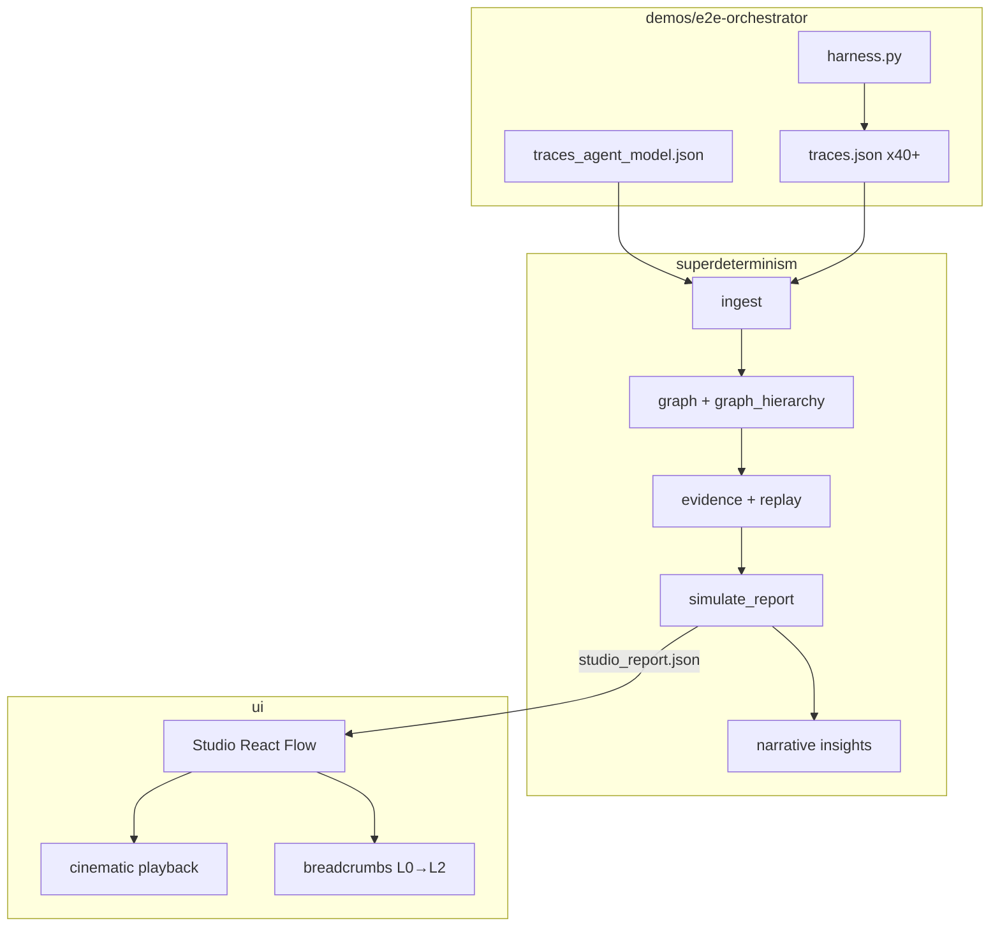
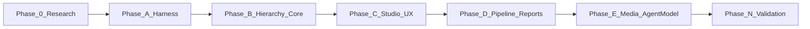

# P3 — Multi-layer orchestration demo & Studio cinematic walkthrough

> Nawab master plan — entire feature execution in one document.  
> **Mode:** feature  
> Copy authority: this file. On approval, link from root `IMPLEMENTATION_PLAN.md` and track in `PROGRESS.md`.

---

## §0 Plan metadata

| Field | Value |
|-------|-------|
| **Mode** | feature |
| **Stack** | Python 3.10+ (`superdeterminism` core) · LangGraph optional extra · Vite/React/TypeScript Studio (`ui/`) |
| **Base branch** | `main` |
| **Feature branch** | `cursor/multi-layer-orchestration-demo-0e05` |
| **Authority docs** | [PROJECT_OVERVIEW.md](../../PROJECT_OVERVIEW.md) · [docs/architecture.md](../architecture.md) · [docs/design/STUDIO_SHAPE.md](../design/STUDIO_SHAPE.md) · [docs/methodology.md](../methodology.md) · [docs/reports/E2E_LANGGRAPH_STUDIO.md](../reports/E2E_LANGGRAPH_STUDIO.md) |
| **Estimated commits** | 20–24 |
| **Lead agent** | Orchestrate, commit, integrate subagents, record walkthrough artifacts, PR |

---

## §1 North star & scope boundary

### Objective

Replace the **flat 3-node** LangGraph demo with a **multi-layer orchestration showcase**: orchestrator → specialist agents → tools/MCPs/skills, visible layer-by-layer in Unagent Studio (with per-layer screenshots), cinematic simulation playback (orchestration → task assignment → in-agent L0 splice), multi-run trace analysis, and a **human-readable architecture improvement brief** — validated using **agent-as-model** (Cursor cloud agent executes scripted scenarios and emits ingestible traces).

### Deliverables

| # | Artifact | Description |
|---|----------|-------------|
| D1 | `demos/e2e-orchestrator/` | New harness: supervisor + 3 specialist agents + tools/MCP/skill stubs; ≥40 multi-run traces |
| D2 | `src/superdeterminism/graph_hierarchy.py` | Emit nested `subgraph` / `children` from span parentage + `advisor.*` layer tags |
| D3 | `studio-report` v1.1 | Hierarchical graph + phased `simulation_events` + `narrative` improvement bullets |
| D4 | Studio UI | Layer lens, cinematic playback phases, drill-down wired to backend hierarchy |
| D5 | `docs/reports/E2E_ORCHESTRATOR_STUDIO.md` | Full report with **PNG per layer** + embedded simulation video |
| D6 | `docs/assets/e2e-orchestrator/` | Layer screenshots (L0/L1/L2) + `studio_simulation_cinematic.mp4` |
| D7 | `scripts/capture_studio_layers.sh` | Headless or guided capture helper for layer PNGs |
| D8 | Agent-as-model trace pack | `demos/e2e-orchestrator/traces_agent_model.json` from cloud-agent scripted runs |
| D9 | `tests/test_e2e_orchestrator_demo.py` | Regression: harness → pipeline → hierarchical report contract |

### Non-goals

- No live production LLM calls (L1 simulation remains gated; fake models + agent-as-model scripted runs only).
- No auto-apply of refactors; scaffold remains illustrative.
- No P2 sink live APIs (Langfuse/MLflow live).
- No hosted SaaS Studio deployment.
- No full rewrite of `graph.reconstruct` flat path — hierarchy is additive.
- No promise of bit-exact replay from a single trace.
- No new npm dependencies beyond what Studio already uses (elkjs, xyflow).

### Priority

| Priority | Items |
|----------|-------|
| **P0** | D1 harness + multi-run traces · D2 hierarchy emission · D3 studio-report · D4 layer drill-down + cinematic playback · D5/D6 media · D9 tests · human improvement narrative |
| **P1** | D7 capture script automation · D8 full agent-as-model OTLP export (vs scripted JSON traces) · per-run comparison heatmap in Studio · joint multi-node refactor ranking |

---

## §2 Prerequisites & blockers

| Item | Status | Blocks | Resolution |
|------|--------|--------|------------|
| LangGraph extra installable | done | Phase A harness | `pip install -e ".[dev,langgraph]"` |
| Studio hierarchical UI hooks (`children`/`subgraph`) | done | Phase C UI only | Already in `ui/src/state/studioReducer.ts` |
| Backend emits flat graph only | **pending** | Phase B, C | Implement `graph_hierarchy.py` |
| `schemas/report-v1.json` lacks hierarchy fields | **pending** | Phase B | Extend schema (backward compatible) |
| Screen recording for cinematic video | pending | Phase E | Cloud agent `RecordScreen` + Studio dev server |
| agent-patterns MCP | unavailable in cloud | Phase 0 research | Use `agentic-system-design` skill + [Agent Patterns Catalog](https://www.agentpatternscatalog.org/) docs offline |

**Hard rule:** Phase B does not start until Phase A harness emits traces with consistent parent span IDs and `advisor.layer` attributes.

---

## §3 Authority & artifact map

| Document | Path | Role |
|----------|------|------|
| Domain graph contract | `docs/architecture.md` | Read-only — node kinds, edge kinds, claim hygiene |
| Studio layout brief | `docs/design/STUDIO_SHAPE.md` | Read-only — shell, breadcrumbs, playback |
| Methodology | `docs/methodology.md` | Read-only — L0/L1/L2, simulation ≠ production |
| Prior E2E report | `docs/reports/E2E_LANGGRAPH_STUDIO.md` | Template for D5 narrative structure |
| Report schema | `schemas/report-v1.json` | Writable extension (additive fields) |
| This plan | `docs/plans/P3-multi-layer-orchestration-demo.md` | Execution contract |
| PROGRESS | `PROGRESS.md` | Writable — phase status |
| DECISIONS | `DECISIONS.md` | Writable — ADRs for hierarchy + agent-as-model |

Subagents: **read-only** on `src/superdeterminism/pipeline.py`, `docs/methodology.md`, claim-hygiene sections.

---

## §4 Architecture & system map

### Target topology (demo subject)

Inspired by **Supervisor / Orchestrator** pattern (agentic-system-design: orchestrator owns step budget and routing; tools are narrow contracts).

```text
┌─────────────────────────────────────────────────────────────┐
│ L0 — ORCHESTRATOR (supervisor)                              │
│   task_router: classify intent → assign specialist agent    │
└───────────────┬─────────────────┬─────────────────┬─────────┘
                │ handoff           │ handoff         │ handoff
        ┌───────▼──────┐    ┌───────▼──────┐   ┌──────▼───────┐
        │ L1 research  │    │ L1 code      │   │ L1 data      │
        │ _agent       │    │ _agent       │   │ _agent       │
        └───┬──────┬───┘    └───┬──────┬───┘   └───┬──────┬───┘
            │      │            │      │           │      │
     ┌──────▼┐ ┌───▼────┐  ┌────▼──┐ ┌─▼─────┐ ┌───▼──┐ ┌──▼────┐
     │web_   │ │mcp_    │  │code_  │ │skill_ │ │sql_  │ │mcp_   │
     │search │ │arxiv   │  │exec   │ │lint   │ │query │ │warehouse│
     │(tool) │ │(mcp)   │  │(tool) │ │(skill)│ │(tool)│ │(mcp)  │
     └───────┘ └────────┘  └───────┘ └───────┘ └──────┘ └───────┘
        L2 — TOOLS / MCPs / SKILLS (per owning agent)
```

**Planted architecture flaws** (for advisor to surface):

| Flaw | Node(s) | Expected advisor signal |
|------|---------|-------------------------|
| Stable JSON router misclassified as LLM | `task_router` | **FlipToDet** (n≥30, tail_stable) |
| Same agent, tool-then-answer variance | `research_agent` / `model` inner | **ABSTAIN** (diverged) |
| Deterministic tool already optimal | `sql_query` | ABSTAIN (already det) |
| MCP call with unstable latency class | `mcp_arxiv` | STRENGTHEN_SDB or ABSTAIN |
| Orchestrator assigns wrong agent 5% of runs | `task_router` handoff edges | Lower Wilson bound; narrative flags routing eval gap |

### Data flow



### Target repo layout (new/changed paths)

```text
demos/e2e-orchestrator/
├── README.md
├── harness.py              # LangGraph supervisor + 3 agent subgraphs
├── scenarios.yaml          # task mix: research / code / data / ambiguous
├── run_pipeline.sh
├── traces.json
├── traces_agent_model.json
├── studio_report.json
├── report.json
└── scaffold/

src/superdeterminism/
├── graph_hierarchy.py      # NEW — nested subgraph builder
├── narrative.py            # NEW — human improvement bullets
└── cli.py                  # studio-report wires hierarchy + narrative

ui/src/
├── components/LayerLens.tsx    # NEW
├── components/CinematicPlayback.tsx  # NEW
├── state/studioReducer.ts      # phase-aware playback
└── lib/playbackPhases.ts     # NEW

docs/
├── reports/E2E_ORCHESTRATOR_STUDIO.md
└── assets/e2e-orchestrator/
    ├── layer_L0_orchestrator.png
    ├── layer_L1_agents.png
    ├── layer_L1_research_agent_tools.png
    ├── layer_L2_tools_mcp_skills.png
    └── studio_simulation_cinematic.mp4

tests/test_e2e_orchestrator_demo.py
tests/test_graph_hierarchy.py
```

### Trust boundaries

- Harness uses fake chat models; agent-as-model runs are **scripted cloud-agent scenarios** with deterministic canned responses — no user secrets.
- Studio proposal export remains draft-only.
- `advisor.*` / `det.*` fields only; never invent `gen_ai.*` keys.

---

## §5 Workstreams

| ID | Name | Owns paths | Depends on | Agent |
|----|------|------------|------------|-------|
| WS-A | Orchestrator harness & traces | `demos/e2e-orchestrator/` | §2 LangGraph extra | lead |
| WS-B | Hierarchy core & narrative | `src/superdeterminism/graph_hierarchy.py`, `narrative.py`, `schemas/` | WS-A trace shape | lead |
| WS-C | Studio layer UX & cinematic playback | `ui/src/` | WS-B studio-report sample | lead (+ computerUse for capture) |
| WS-D | Docs, media, agent-as-model | `docs/reports/`, `docs/assets/`, `scripts/` | WS-C Studio running | lead |

### WS-A — Orchestrator harness & traces

- **Objective:** Runnable LangGraph demo with ≥10 logical nodes across 3 layers; ≥40 traces with intentional variance.
- **Phases:** A (harness), partial E (agent-as-model traces).
- **Integration:** `traces.json` consumed by `run_pipeline.sh` and tests.

### WS-B — Hierarchy core & narrative

- **Objective:** `studio-report` emits nested graph + phased simulation events + `narrative` improvement list.
- **Phases:** B.
- **Integration:** `studio_report.json` drives Studio breadcrumbs without UI-side synthesis.

### WS-C — Studio layer UX

- **Objective:** Layer lens, cinematic playback (orchestration → assign → in-agent), per-layer visual clarity.
- **Phases:** C.
- **Integration:** Load `demos/e2e-orchestrator/studio_report.json` as default demo URL.

### WS-D — Docs, media, agent-as-model

- **Objective:** E2E report mirroring `E2E_LANGGRAPH_STUDIO.md` but multi-layer; PNGs + MP4; cloud agent validation log.
- **Phases:** D, E.
- **Integration:** README and root `docs/overview.md` link to new report.

---

## §6 Agent orchestration & subagent spawn map

| ID | Trigger | Type | readonly | Task | Sync point | Gate |
|----|---------|------|----------|------|------------|------|
| S1 | Phase A start | explore | yes | Map LangGraph nested subgraph + span parent patterns in codebase | Before harness design | — |
| S2 | Phase C | computerUse | no* | Studio UI: load report, capture layer PNGs, exercise cinematic playback | Commit C4 | visual checklist |
| S3 | Phase E | computerUse | no* | Record cinematic simulation video (orchestration → agents → in-agent) | Commit E2 | video file exists |
| S4 | Phase N | generalPurpose | yes | ponytail-review on full diff | Before PR | findings addressed |

\*computerUse operates on UI only; lead commits captured assets.

### Spawn S1 — LangGraph hierarchy patterns

```text
Full Repository Path: /workspace
Workstream: WS-A
Task: Find how classify_span maps spans; how parent_span_id is set in demos/e2e-langgraph/harness.py;
      list attributes needed for advisor.layer tagging.
Authority: docs/architecture.md, src/superdeterminism/classify.py
Return: bullet paths + recommended span attribute contract for 3-layer hierarchy
Do NOT: edit files
```

### Spawn S2 — Layer screenshots

```text
Full Repository Path: /workspace
Workstream: WS-C
Task: Start Studio with ?report=/e2e_orchestrator_studio_report.json; capture PNG for:
      L0 orchestrator view, L1 agents view, L2 research_agent drill-down.
Save to: docs/assets/e2e-orchestrator/
Return: list of saved filenames + any UI bugs blocking capture
```

### Spawn S3 — Cinematic video

```text
Full Repository Path: /workspace
Workstream: WS-D
Task: Record full simulation playback: start at orchestrator graph, play cinematic mode,
      show task assignment events, drill into research_agent during splice event.
Save as: docs/assets/e2e-orchestrator/studio_simulation_cinematic.mp4
```

**Parallel limit:** 2  
**File ownership:** lead owns all `src/` and `ui/`; subagents do not commit.

---

## §7 Phase map & dependencies



| Phase | Objective | Workstreams | Commits | Depends on | Exit gate |
|-------|-----------|-------------|---------|------------|-----------|
| 0 | Research & ADR | all | docs | §2 | ADR-00XX approved in plan |
| A | Orchestrator harness + traces | WS-A | 1–6 | 0 | `harness.py --n 40` → `traces.json` |
| B | Hierarchy + narrative core | WS-B | 7–11 | A | hierarchical `studio-report` JSON validates |
| C | Studio layer UX + cinematic playback | WS-C | 12–16 | B | UI tests green; manual layer drill works |
| D | Pipeline script + E2E report draft | WS-A,D | 17–18 | C | `run_pipeline.sh` exits 0 |
| E | Agent-as-model traces + media capture | WS-D | 19–21 | D | PNGs + MP4 in `docs/assets/e2e-orchestrator/` |
| N | Validation & hardening | all | 22–24 | E | `./scripts/validate.sh` + new e2e test |

---

## §8 Todo registry

```yaml
todos:
  - id: p3-phase-0-research
    content: "Phase 0: ADR hierarchy contract + span attribute spec"
    status: pending
  - id: p3-phase-a-harness
    content: "Phase A: demos/e2e-orchestrator harness + 40+ traces"
    status: pending
  - id: p3-phase-b-hierarchy
    content: "Phase B: graph_hierarchy.py + narrative.py + schema"
    status: pending
  - id: p3-phase-c-studio
    content: "Phase C: Layer lens + cinematic playback UI"
    status: pending
  - id: p3-phase-d-pipeline
    content: "Phase D: run_pipeline.sh + E2E_ORCHESTRATOR_STUDIO.md"
    status: pending
  - id: p3-phase-e-media
    content: "Phase E: agent-as-model traces + PNGs + simulation video"
    status: pending
  - id: subagent-s1-explore
    content: "Spawn S1: explore span/hierarchy patterns"
    status: pending
  - id: subagent-s2-screenshots
    content: "Spawn S2: capture layer PNGs via Studio"
    status: pending
  - id: subagent-s3-video
    content: "Spawn S3: record cinematic simulation MP4"
    status: pending
  - id: p3-phase-n-hardening
    content: "Phase N: test_e2e_orchestrator + validate.sh"
    status: pending
```

---

## §9 Commit matrix

> One row = one commit. Target: **22 rows** for multi-package feature (Python + UI + demo + docs).

### Phase 0 — Research

| # | WS | Commit | Contents | Tests (same commit) | Gate | Agent |
|---|-----|--------|----------|---------------------|------|-------|
| 1 | all | `docs: ADR hierarchical graph layers for Studio` | `docs/decisions/00XX-hierarchical-studio-graph.md` | — | markdown lint | lead |

### Phase A — Harness (WS-A)

| # | WS | Commit | Contents | Tests (same commit) | Gate | Agent |
|---|-----|--------|----------|---------------------|------|-------|
| 2 | A | `feat(demo): scaffold e2e-orchestrator harness` | `demos/e2e-orchestrator/` README, scenarios.yaml, empty harness | — | — | lead |
| 3 | A | `feat(demo): LangGraph supervisor graph with 3 specialist agents` | `harness.py` L0/L1 topology | — | `python harness.py --n 1` | lead |
| 4 | A | `feat(demo): L2 tools MCP and skill stubs per agent` | tool/MCP/skill nodes + span attrs | — | harness smoke | lead |
| 5 | A | `feat(demo): multi-run trace variance scenarios` | 40+ traces, 5% routing noise, divergent research path | `tests/test_e2e_orchestrator_demo.py` (partial) | harness `--n 40` | lead |
| 6 | A | `chore(demo): e2e-orchestrator run_pipeline.sh` | shell script mirroring langgraph demo | script exits 0 | `./run_pipeline.sh` | lead |

**Phase A gate:** `pip install -e ".[dev,langgraph]" && python demos/e2e-orchestrator/harness.py --n 40`

### Phase B — Hierarchy core (WS-B)

| # | WS | Commit | Contents | Tests (same commit) | Gate | Agent |
|---|-----|--------|----------|---------------------|------|-------|
| 7 | B | `test: graph hierarchy golden fixtures` | `tests/test_graph_hierarchy.py` + fixtures | pytest | pytest | lead |
| 8 | B | `feat(core): graph_hierarchy nested subgraph builder` | `graph_hierarchy.py` | test green | pytest | lead |
| 9 | B | `feat(core): advisor.layer span classification hooks` | `classify.py` minimal `advisor.layer` read | test green | pytest | lead |
| 10 | B | `feat(core): narrative architecture improvement bullets` | `narrative.py` | unit tests | pytest | lead |
| 11 | B | `feat(cli): studio-report emits hierarchy + narrative + phased events` | `cli.py`, `simulate.py` event kinds | test green | studio-report smoke | lead |

**Phase B gate:** `python -m superdeterminism studio-report demos/e2e-orchestrator/traces.json --out /tmp/h.json && jq '.graph.nodes[0].subgraph' /tmp/h.json`

### Phase C — Studio UX (WS-C)

| # | WS | Commit | Contents | Tests (same commit) | Gate | Agent |
|---|-----|--------|----------|---------------------|------|-------|
| 12 | C | `feat(ui): layer lens toggle L0 L1 L2` | `LayerLens.tsx`, reducer | vitest | `npm test` | lead |
| 13 | C | `feat(ui): cinematic playback phase machine` | `playbackPhases.ts`, `CinematicPlayback.tsx` | vitest | `npm test` | lead |
| 14 | C | `feat(ui): simulation events for assign_task and layer_enter` | reducer highlights + status copy | vitest | `npm test` | lead |
| 15 | C | `feat(ui): inspector shows layer role and MCP skill badges` | `Inspector.tsx`, `StudioNode.tsx` | vitest | `npm test` | lead |
| 16 | C | `chore(ui): default demo route e2e-orchestrator report` | `ui/public/` copy + README | `npm run build` | build | lead |

**Phase C gate:** `cd ui && npm test && npm run build`

### Phase D — Reports (WS-D)

| # | WS | Commit | Contents | Tests (same commit) | Gate | Agent |
|---|-----|--------|----------|---------------------|------|-------|
| 17 | D | `docs: E2E orchestrator studio report` | `docs/reports/E2E_ORCHESTRATOR_STUDIO.md` | — | links resolve | lead |
| 18 | D | `chore(demo): check in studio_report.json and report.json` | generated artifacts | e2e test | pytest e2e | lead |

### Phase E — Agent-as-model & media (WS-D)

| # | WS | Commit | Contents | Tests (same commit) | Gate | Agent |
|---|-----|--------|----------|---------------------|------|-------|
| 19 | E | `feat(demo): agent-as-model trace capture script` | `capture_agent_traces.py` + `traces_agent_model.json` | smoke | script runs | lead |
| 20 | E | `docs: add per-layer PNG assets` | `docs/assets/e2e-orchestrator/*.png` | — | files exist | lead |
| 21 | E | `docs: add cinematic simulation video` | `studio_simulation_cinematic.mp4` | — | plays in report | lead |

### Phase N — Validation

| # | WS | Commit | Contents | Tests (same commit) | Gate | Agent |
|---|-----|--------|----------|---------------------|------|-------|
| 22 | all | `test: e2e orchestrator demo regression` | complete `test_e2e_orchestrator_demo.py` | pytest | pytest | lead |
| 23 | all | `chore: validate.sh includes orchestrator demo smoke` | `scripts/validate.sh` | validate | `./scripts/validate.sh` | lead |
| 24 | all | `docs: PROGRESS and LEARNING sync for P3` | PROGRESS.md, LEARNING.md | — | — | lead |

---

## §10 Test & CI strategy

| Tier | Purpose | Trigger | Command |
|------|---------|---------|---------|
| Fast | unit, hierarchy, reducer | every commit | `PYTHONPATH=src python -m pytest -q tests/test_graph_hierarchy.py` · `cd ui && npm test` |
| Medium | e2e orchestrator demo | PR | `PYTHONPATH=src python -m pytest -q tests/test_e2e_orchestrator_demo.py` |
| Slow | full validate + UI build | pre-PR | `./scripts/validate.sh` |
| Manual | layer PNG + cinematic video | Phase E | computerUse checklist §6 S2/S3 |

### CI workflow map

| Job | Trigger | Command |
|-----|---------|---------|
| existing `ci.yml` pytest | PR | unchanged + new tests picked up |
| UI job | PR | `npm ci && npm test && npm run build` |

**Test locations:** `tests/test_graph_hierarchy.py`, `tests/test_e2e_orchestrator_demo.py`, `ui/src/**/*.test.ts`  
**Contract-first:** commit 7 (tests/fixtures) before commit 8 (implementation)

---

## §11 Research log & decisions

| Topic | Options | Choice | Source / skill | Record in |
|-------|---------|--------|--------------|-----------|
| Complex subject repo | External only (agent-service-toolkit full) / In-repo new demo / Fork external | **In-repo `e2e-orchestrator`** | Reuse `demos/e2e-langgraph` patterns; avoid network dep | DECISIONS.md |
| Hierarchy representation | UI-only grouping / Backend `subgraph` emission / Separate graph per layer | **Backend `subgraph` on L0/L1 nodes** | `STUDIO_SHAPE.md` already defines drill-down | ADR-00XX |
| Layer identification | Graph node naming / Span `advisor.layer` / Parent span only | **`advisor.layer` + parent_span_id** | `docs/architecture.md` advisor-owned fields | ADR-00XX |
| Agent-as-model | Live Cursor OTLP / Scripted cloud-agent scenarios | **Scripted scenarios** mirroring cloud agent tool calls (P0); OTLP export P1 | User request + cloud constraints | DECISIONS.md |
| Orchestration pattern | Sequential chain / Supervisor routing / Swarm | **Supervisor routing** to 3 specialists | `agentic-system-design` orchestrator layer | plan §4 |
| Cinematic playback | New video encoder / In-app phased playback + screen record | **In-app phases + RecordScreen** | Existing mp4 pattern in E2E_LANGGRAPH report | plan §6 |
| Multi-run analysis | Per-run UI overlay / Pooled Wilson only / Narrative bullets | **Pooled Wilson + narrative bullets** (P0); per-run heatmap P1 | `methodology.md` | narrative.py |

---

## §12 Documentation & artifact sync

| Event | Update |
|-------|--------|
| Plan approved | Link from `IMPLEMENTATION_PLAN.md`; `PROGRESS.md` P3 section |
| Phase A complete | `demos/e2e-orchestrator/README.md`, `PHASE_A_COMPLETION.md` |
| Phase E complete | `docs/reports/E2E_ORCHESTRATOR_STUDIO.md`, assets |
| Arch decision | `docs/decisions/00XX-hierarchical-studio-graph.md` |
| Cutover | README demo section points to orchestrator demo as primary |

---

## §13 Quality gates & checkpoints

| Gate | When | Command / checklist | Blocks |
|------|------|---------------------|--------|
| Phase A done | end A | `harness.py --n 40`; trace count ≥40 | Phase B |
| Hierarchy JSON | end B | `jq` subgraph present on `task_router` | Phase C |
| Studio manual | end C | Layer lens + drill + playback phases | Phase D |
| Media complete | end E | 4+ PNGs + 1 MP4 referenced in report | Phase N |
| PR ready | review | `./scripts/validate.sh` | merge |

### Human checkpoints

- [ ] **User approves topology** (supervisor + 3 agents + tool/MCP/skill layout) before Phase A commit 3
- [ ] **User approves cinematic script** (playback phase order) before Phase C commit 13
- [ ] **User reviews improvement bullets** in narrative before Phase D report final

---

## §14 Validation & hardening

### Repo walkthrough

1. Static audit: no LangChain import in core; no `gen_ai.*` invention; claim hygiene in narrative
2. Test matrix: `test_graph_hierarchy` → `test_e2e_orchestrator` → full pytest → UI vitest → build
3. Adjacent: existing `test_e2e_langgraph_demo.py` still passes (no regression)
4. ponytail-review on diff; verify hierarchy is minimal additive layer
5. Manual: load Studio, walk L0→L1→L2 breadcrumbs, play cinematic mode end-to-end
6. Verify agent-as-model traces ingest same as harness traces

### Orchestrator

`./scripts/validate.sh` — add step 4b: orchestrator `studio-report` smoke

---

## §15 Rollout & cutover

N/A — feature addition; no consumer switch.

**Demo parity checklist:**

- [ ] README "Quick demo" lists orchestrator path first; langgraph demo remains secondary
- [ ] `examples/` unchanged for minimal fixtures
- [ ] Studio empty state mentions new demo URL

---

## §16 Exit criteria

### P0 (must pass)

- [ ] `demos/e2e-orchestrator/` runs end-to-end with ≥40 traces and ≥3 advisor actions (not all ABSTAIN)
- [ ] `studio-report` JSON includes nested `subgraph` on orchestrator node with L1 agents; agents have L2 children
- [ ] Studio: layer lens shows L0/L1/L2; breadcrumbs drill to tools/MCPs/skills
- [ ] Cinematic playback: phases `orchestration` → `assign` → `in_agent` with distinct UI status
- [ ] `docs/reports/E2E_ORCHESTRATOR_STUDIO.md` with ≥4 layer PNGs and simulation MP4
- [ ] `narrative` field contains ≥5 human-readable improvement bullets grounded in report evidence
- [ ] Agent-as-model trace file ingests and produces same graph identity class as harness
- [ ] `./scripts/validate.sh` exits 0
- [ ] `tests/test_e2e_orchestrator_demo.py` green

### P1 (defer ok)

- [ ] Per-run comparison heatmap in Studio
- [ ] Full OTLP export from live cloud agent session
- [ ] `scripts/capture_studio_layers.sh` fully headless (Playwright)
- [ ] Joint multi-node refactor ranking

---

## §17 Risks & contingencies

| Risk | Likelihood | Impact | Mitigation | Contingency |
|------|------------|--------|------------|-------------|
| LangGraph nested subgraph span parentage inconsistent | med | high | S1 explore before harness; golden fixture in commit 7 | Flatten L1 into L0 edges with `advisor.layer` tags only |
| Studio ELK layout breaks on drill-down | med | med | Re-layout per breadcrumb frame (existing pattern) | Manual node positions in demo JSON |
| Cinematic playback confuses users vs L0 splice | low | med | Clear disclaimer strip; phase labels | Fall back to standard step playback |
| All nodes ABSTAIN (insufficient n) | low | high | `--n 40` + planted stable router | Lower `--n-min` for demo only with Wilson note in narrative |
| Video capture flaky in cloud | med | med | RecordScreen + shorter scripted play | GIF fallback + static storyboard PNGs |
| Scope creep to P2 sinks | med | high | Non-goals §1 | Stay in harness + file traces |

---

## §18 Execution protocol

```text
1. Load this plan + nawab-plans skill; ponytail on every code edit
2. User approves topology checkpoint (§13) → Phase A
3. Phase 0: ADR commit 1
4. Phase A: commits 2–6; spawn S1 at start
5. Phase B: contract tests first (commit 7), then hierarchy (8–11)
6. Phase C: Studio UX (12–16); spawn S2 after commit 16
7. Phase D: report + checked-in artifacts (17–18)
8. Phase E: agent-as-model (19); spawn S3 for video (21); PNGs (20)
9. Phase N: commits 22–24; validate.sh green
10. Draft PR with report, video, and improvement bullets
```

---

## Appendix A — Human-readable improvement output (target shape)

The `narrative` module will emit markdown like:

```markdown
## Architecture improvements (simulation ≠ production)

1. **Promote `task_router` to a deterministic policy node** — 40/40 runs produced identical routing JSON; L0 splice tail_stable; estimated token savings ~12% on orchestration path.
2. **Split `research_agent` tool-call from answer generation** — cassette diverged (tool-then-answer vs direct answer); keep tool path deterministic, isolate LLM to synthesis step.
3. **Add routing eval for ambiguous intents** — 2/40 runs assigned wrong specialist; add golden set before tightening router determinism.
4. **Label MCP calls explicitly in traces** — `mcp_arxiv` spans should carry `advisor.layer=L2` and `advisor.mcp_namespace=arxiv` for Studio grouping.
5. **STRENGTHEN_SDB on `code_exec` sandbox** — side-effect gate present but schema validation at 0.94; add output schema check before merge.
```

Studio will render `narrative` in the inspector rail when no node is selected.

---

## Appendix B — Cinematic playback script (for video)

| Step | Time | View | Event |
|------|------|------|-------|
| 1 | 0:00 | L0 orchestrator graph | Load report |
| 2 | 0:10 | Play cinematic | `layer_enter` orchestrator |
| 3 | 0:20 | Highlight `task_router` | `assign_task` → research_agent |
| 4 | 0:35 | Drill into research_agent | breadcrumb L1 |
| 5 | 0:50 | Play inside agent | `cassette` → `splice` on inner model |
| 6 | 1:10 | Inspector | Show FlipToDet / ABSTAIN evidence |
| 7 | 1:25 | Pop to L0 | Show narrative improvement bullets |

---

## Open questions

1. **Topology approval** — Is supervisor + research/code/data agents the right cast, or do you want a specific external repo (e.g. full `agent-service-toolkit` multi-agent mode) vendored/submoduled?
2. **Agent-as-model depth** — P0 scripted cloud-agent scenarios sufficient, or must we capture live OTLP from this Cursor run's tool calls?
3. **Demo primacy** — Should orchestrator demo **replace** e2e-langgraph as the README hero, or sit alongside?
4. **Variance appetite** — OK to plant a 5% routing error for narrative drama, or keep all runs clean except inner-agent divergence?

---

## Approval

**Mode:** feature  
**Status:** COMPLETE (2026-09-06) — see [PHASE_P3_COMPLETION.md](../../PHASE_P3_COMPLETION.md)

Defaults applied: in-repo supervisor topology, scripted agent-as-model, orchestrator as README hero alongside langgraph demo, 5% routing variance.

Lead agent followed **§18 Execution protocol**. P1 items (per-run heatmap, headless capture) deferred.
