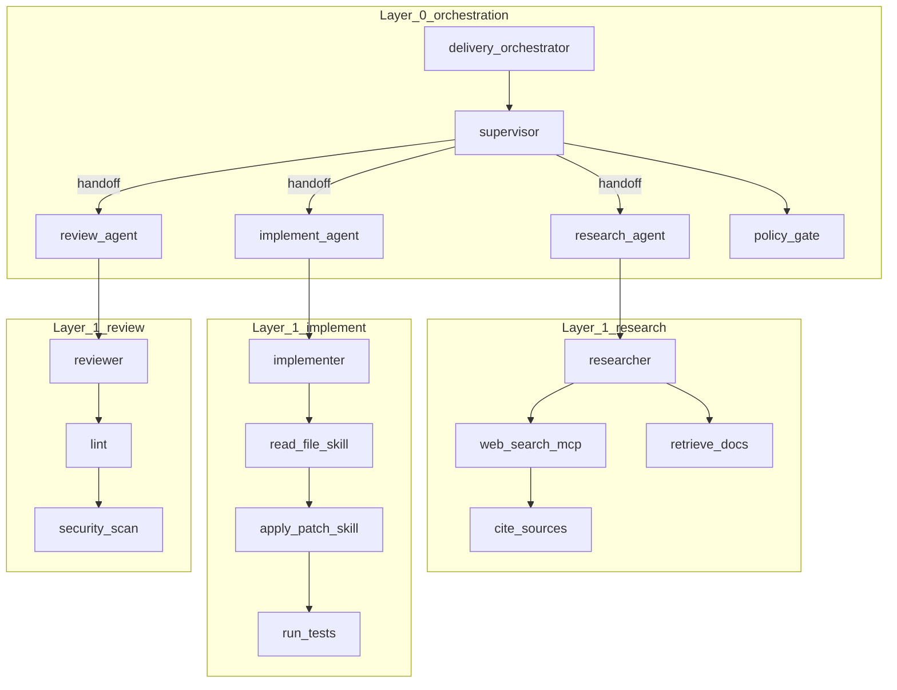
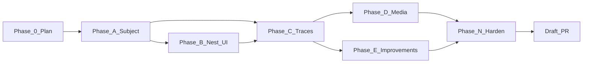

# Layered multi-agent Studio E2E — Master Execution Plan

> Nawab master plan — entire feature execution in one document.
> **Mode:** feature
> Authority for this run. Live status: [PROGRESS.md](../../PROGRESS.md).

---

## §0 Plan metadata

| Field | Value |
|-------|-------|
| **Mode** | feature |
| **Stack** | Python 3.11+ (`superdeterminism` stdlib core + optional LangGraph extra) · Unagent Studio (`ui/`: Vite, React, TypeScript, `@xyflow/react`, elkjs) |
| **Base branch** | `main` |
| **Feature branch(es)** | `cursor/layered-multiagent-studio-02f6` |
| **Authority docs** | [PROJECT_OVERVIEW.md](../../PROJECT_OVERVIEW.md), [docs/methodology.md](../methodology.md), [docs/architecture.md](../architecture.md), [docs/design/STUDIO_SHAPE.md](../design/STUDIO_SHAPE.md), [docs/p1-langgraph.md](../p1-langgraph.md), [docs/decisions/0003-no-auto-apply.md](../decisions/0003-no-auto-apply.md), [docs/decisions/0002-v0-offline-first.md](../decisions/0002-v0-offline-first.md) |
| **Estimated commits** | 10–12 (medium product feature + demo media/docs) |
| **Lead agent** | Orchestrate, act as the *agent-as-model* for test runs, commit, integrate, capture Studio media, PR |
| **Ponytail intensity** | `full` — reuse Studio breadcrumb/subgraph; do not rebuild a second graph viewer |

---

## §1 North star & scope boundary

### Objective

Replace the too-simple flat three-node E2E (`guard_input → model ⇄ calculator`) with a **layered** multi-agent subject: an orchestrator, specialist agents, and per-agent tools / MCP / skills — shown layer-by-layer in Studio (photos), walked by a simulation that starts on the orchestration screen then enters agents (video), then reasoned on from **multiple real traces** into **human-legible architecture improvements**. The lead Cursor agent *is* the model for those runs.

### Deliverables

- New demo `demos/e2e-multiagent/` — LangGraph supervisor + three specialist subgraphs + policy gate
- Agent-as-model scenario transcripts (lead agent authored the I/O; harness replays them)
- ≥30 traces across distinct task types (research / implement+review / full delivery / policy-block)
- Hierarchical Studio report (`children` / `subgraph` on agents) so drill-down is real, not a screenshot fake
- Studio playback **layer-follow** — when the active event is inside an agent, the canvas enters that subgraph
- Layer photos: orchestration · each agent opened · one tool/MCP/skill leaf
- Simulation video: orchestrator → task assigned → inside-agent playback
- Unagent `recommend` / `simulate` / `scaffold` on those traces
- Human-legible `IMPROVEMENTS.md` grounded in the actual report (not generic advice)
- Regression tests + docs + draft PR

### Non-goals

- Do not replace or delete `demos/e2e-langgraph/` (keep the simple FlipToDet teaching case)
- Do not vendor a third-party monorepo into this tree
- Do not auto-apply scaffold patches to any `graph.py`
- Do not call paid LLM APIs (agent-as-model + replay; no keys)
- Do not change fail-closed `_decide` rules or invent `gen_ai.*` keys
- Do not nest the *core* `ArchitectureGraph` used by recommend/identity (flat reconstruct stays the contract)
- Do not build a second Studio or a new graph library
- No CrewAI / MAF live sinks (still P2)

### Priority

| Priority | Items |
|----------|-------|
| **P0** | Layered subject + agent-as-model traces · nest for Studio · layer-follow playback · photos + video · recommend + human-legible improvements · tests |
| **P1** | Richer MCP live calls, extra specialists, L1 opt-in, README hero swap to the new graph |

---

## §2 Prerequisites & blockers

| Item | Status | Blocks | Resolution |
|------|--------|--------|------------|
| Studio already supports `children` / `subgraph` + breadcrumbs | done | — | Reuse; only emit hierarchy + layer-follow |
| LangGraph extra installable (`pip install -e ".[dev,langgraph]"`) | pending | Phase A harness | Install if missing; skip harness test if extra absent (same pattern as existing E2E) |
| `n_min` default 30 | done | Phase C mix | Emit ≥30 traces; use `--n-min 1` only for unit tests, not the demo report |
| Agent-patterns MCP | unavailable this run | §11 citations | Fall back to `agentic-system-design` + architecture.md example; note in research log |
| Computer-use / browser for Studio media | pending | Phase D | If executor missing: still emit report + layer PNGs via headless if possible; state the gap |
| Existing `demos/e2e-langgraph` green | done | — | Do not regress `tests/test_e2e_langgraph_demo.py` |

**Hard rule:** Phase A does not start until the LangGraph extra import-check has a documented workaround (skip-if-missing, same as current E2E).

---

## §3 Authority & artifact map

| Document | Path | Role |
|----------|------|------|
| This plan | `docs/plans/layered-multiagent-e2e.md` | **Writable** execution contract |
| Methodology | `docs/methodology.md` | **Read-only** — FlipToDet / ABSTAIN / L0 rules |
| Architecture mapping | `docs/architecture.md` | **Read-only** — node_kind, ReAct+subgraph example |
| Studio shape | `docs/design/STUDIO_SHAPE.md` | **Read-only** — breadcrumb/hierarchy contract |
| No auto-apply ADR | `docs/decisions/0003-no-auto-apply.md` | **Read-only** |
| Offline-first ADR | `docs/decisions/0002-v0-offline-first.md` | **Read-only** |
| IMPLEMENTATION_PLAN | root | **Do not overwrite** — viral hardening history; this plan is the child |
| PROGRESS | `PROGRESS.md` | **Writable** — add this feature’s phase table |
| DECISIONS | `DECISIONS.md` | **Writable** — D21 nest-for-studio, D22 agent-as-model |
| Subject + improvements | `demos/e2e-multiagent/` | **Writable** |
| E2E write-up | `docs/reports/E2E_MULTIAGENT_STUDIO.md` | **Writable** |
| Media | `docs/assets/e2e-multiagent/` | **Writable** |
| Spec Kit | `.specify/` | N/A — not a greenfield product; feature mode |

Subagents (if spawned) treat methodology / ADRs / `_decide` as read-only.

---

## §4 Architecture & system map

### Why the current graph is too simple

Today’s E2E ([docs/reports/E2E_LANGGRAPH_STUDIO.md](../reports/E2E_LANGGRAPH_STUDIO.md)) is one agent, one LLM, one tool:

```text
guard_input → model ⇄ calculator
```

Studio *can* drill into `children` / `subgraph` ([docs/design/STUDIO_SHAPE.md](../design/STUDIO_SHAPE.md)), but `studio-report` emits a **flat** `inspect_traces` graph. There is no orchestrator, no handoff, no MCP/skill surface, and playback never changes layer.

### Target subject — Delivery Orchestrator

Faithful LangGraph **supervisor + compiled subgraphs** (P1 shapes: custom `StateGraph` + inner agent graphs). Catalog language (MCP unavailable; from `agentic-system-design`): orchestrator · specialist agents · tool executor · policy gate.

```text
Layer 0 — orchestration
  delivery_orchestrator          workflow
    supervisor                   llm_reasoner (agent-as-model) + handoff router
      ├─ research_agent          subagent  ──► Layer 1
      ├─ implement_agent         subagent  ──► Layer 1
      ├─ review_agent            subagent  ──► Layer 1
      └─ policy_gate             llm_reasoner (schema-stable → FlipToDet candidate)

Layer 1 — research_agent
  researcher                     llm_reasoner
    ├─ web_search                retriever   advisor.surface=mcp
    ├─ retrieve_docs             retriever
    └─ cite_sources              deterministic_tool

Layer 1 — implement_agent
  implementer                    llm_reasoner
    ├─ read_file                 deterministic_tool   advisor.surface=skill
    ├─ apply_patch               deterministic_tool   advisor.surface=skill  (side-effect)
    └─ run_tests                 deterministic_tool

Layer 1 — review_agent
  reviewer                       llm_reasoner
    ├─ lint                      deterministic_tool
    └─ security_scan             deterministic_tool
```



### Data flow

```text
Lead agent (agent-as-model)
  → authors scenario transcripts (real routing + tool I/O)
  → harness replays through real LangGraph supervisor + subgraphs
  → Unagent-shaped traces (langgraph_node + gen_ai.operation.name + advisor.surface)
  → reconstruct (flat, identity/recommend unchanged)
  → nest_for_studio (hierarchy for UI only)
  → studio-report + narrative run_events
  → Studio: layer photos + layer-follow playback
  → recommend/simulate → IMPROVEMENTS.md
```

### Target layout

```text
demos/e2e-multiagent/
  SUBJECT.md                 # topology + why this size
  README.md                  # regen + Studio URL
  harness.py                 # LangGraph supervisor + subgraphs
  agent_model.py             # AgentAsModel protocol + cassette load
  nest.py                    # thin wrapper calling core nest_for_studio (or import only)
  scenarios/*.json           # agent-as-model transcripts
  traces.json                # ≥30 runs
  studio_report.json
  report.json / simulate.json
  scaffold/                  # illustrative; never auto-applied
  IMPROVEMENTS.md
  run_pipeline.sh
src/superdeterminism/graph.py   # + nest_for_studio()
src/superdeterminism/cli.py     # studio-report attaches nest
ui/src/state/studioReducer.ts   # frameContaining + layer-follow helper
ui/src/App.tsx                  # playback navigates layers
ui/src/types/report.ts          # optional surface on GraphNodeSpec
docs/reports/E2E_MULTIAGENT_STUDIO.md
docs/assets/e2e-multiagent/*.png|*.mp4
tests/test_graph_nest.py
tests/test_e2e_multiagent_demo.py
ui/src/state/studioReducer.test.ts  # layer-follow cases
```

### Trust boundaries

- Scenario transcripts are fixtures, not secrets. No API keys.
- `advisor.surface` / `advisor.skill` only — never invent `gen_ai.*`.
- `apply_patch` / spend-like names stay side-effect / hard-override sensitive.
- Scaffold stays under `--out`. Simulation ≠ production.

---

## §5 Workstreams

| ID | Name | Owns paths | Depends on | Lead / subagent |
|----|------|------------|------------|-----------------|
| WS-A | Subject + agent-as-model | `demos/e2e-multiagent/**` | §2 LangGraph extra | lead (lead *is* the model) |
| WS-B | Nest + Studio layer-follow | `src/superdeterminism/graph.py`, `cli.py`, `ui/src/**` | WS-A span shape | lead |
| WS-C | Pipeline + improvements + media | traces, reports, `docs/assets/e2e-multiagent/`, `docs/reports/` | WS-A+B | lead; computerUse for media |

### WS-A — Subject + agent-as-model

- **Objective:** A real multi-agent LangGraph the previous demo was not.
- **Phases:** A
- **Integration:** traces.json consumed by core CLI unchanged

### WS-B — Nest + layer-follow

- **Objective:** Studio shows layers; playback enters agents.
- **Phases:** B
- **Integration:** `studio-report` JSON is the only new core surface

### WS-C — Evidence + story

- **Objective:** Multiple runs → advisor → photos/video → human-legible points
- **Phases:** C, D, E
- **Integration:** docs + PR evidence

---

## §6 Agent orchestration & subagent spawn map

> See `.cursor/skills/nawab-plans/SUBAGENT_ORCHESTRATION.md`.

| ID | Trigger | Type | readonly | Task | Sync point | Gate |
|----|---------|------|----------|------|------------|------|
| S1 | Phase D | computerUse | false (env only) | Drive Studio: layer screenshots + orchestration→agent video | After studio_report in `ui/public` | files under `docs/assets/e2e-multiagent/` |
| S2 | Phase N | explore | true | Adjacent-test gap check | Before hardening commit | — |

**No parallel generalPurpose writers** — one lead owns all product files (ponytail: avoid overlap).

### Spawn S1 — Studio media

```text
Full Repository Path: /workspace
Workstream: WS-C
Task: Open Unagent Studio at ?report=/e2e_multiagent_studio_report.json
  1) Screenshot Layer 0 (orchestrator + agents)
  2) Click research_agent → screenshot Layer 1 research (tools/MCP)
  3) Back → implement_agent → screenshot skills
  4) Back → review_agent → screenshot tools
  5) Record video: start Layer 0 → Play → when handoff fires, show inside-agent playback
Authority: docs/design/STUDIO_SHAPE.md, this plan §4
Return: absolute paths of PNG/MP4
Do NOT: edit product source, invent UI chrome
```

### Agent-as-model protocol (lead, not a subagent)

The lead Cursor agent **is** the stochastic model for testing (user requirement).

1. For each scenario, the lead reasons as `supervisor` (who to hand off, in what order).
2. Then reasons as the assigned specialist (`researcher` / `implementer` / `reviewer`): which tool/MCP/skill to call, with what args, what the tool returns, what the final commitment is.
3. Then reasons as `policy_gate`: structured `{allow, reason}` only.
4. Those I/O blobs are written to `demos/e2e-multiagent/scenarios/*.json`.
5. `harness.py` **replays** the cassette through real LangGraph nodes (same pattern as the existing FakeList harness, but the messages were produced by this agent, not a canned calculator script).
6. Repeating a scenario n times yields L0 sample size; mixing scenarios yields mixed_workload on the supervisor (expected ABSTAIN).

This is **not** a live production-LLM re-run (D5). It is an offline cassette whose author is this agent.

**Parallel limit:** 1 writer. computerUse only in Phase D.  
**File ownership:** lead owns all paths.

---

## §7 Phase map & dependencies



| Phase | Objective | Workstreams | Commits | Depends on | Exit gate |
|-------|-----------|-------------|---------|------------|-----------|
| 0 | This plan + D16/D17 | all | 1 | — | Plan committed on feature branch |
| A | Harness + agent-as-model scenarios | WS-A | 2 | 0 | `python demos/e2e-multiagent/harness.py --n 2` writes spans with invoke_agent + advisor.surface |
| B | `nest_for_studio` + playback layer-follow | WS-B | 2 | A span contract | `pytest tests/test_graph_nest.py` + `cd ui && npm test` |
| C | ≥30 traces + recommend/simulate/studio-report | WS-C | 1 | A+B | report has FlipToDet on `policy_gate`; supervisor ABSTAIN; graph has subgraphs |
| D | Layer photos + simulation video | WS-C | 1 | C | 4+ PNGs + 1 MP4 in `docs/assets/e2e-multiagent/` |
| E | Human-legible improvements from *this* report | WS-C | 1 | C | `IMPROVEMENTS.md` cites node_id + action + evidence |
| N | Tests, docs, validate, PR | all | 2 | D+E | `pytest tests/test_e2e_multiagent_demo.py tests/test_graph_nest.py tests/test_e2e_langgraph_demo.py` + UI tests |
| Cutover | N/A — demo/docs only | — | — | N | — |

---

## §8 Todo registry

```yaml
todos:
  - id: phase-0-plan
    content: "Phase 0: Write comprehensive nawab plan + ADR notes"
    status: in_progress
  - id: phase-a-subject
    content: "Phase A: Multi-agent LangGraph harness + agent-as-model scenarios"
    status: pending
  - id: phase-b-nest
    content: "Phase B: Hierarchical nest for Studio + playback layer-follow"
    status: pending
  - id: phase-c-traces
    content: "Phase C: Run multi-scenario traces + Unagent recommend/simulate"
    status: pending
  - id: phase-d-media
    content: "Phase D: Layer photos + orchestration-to-agent simulation video"
    status: pending
  - id: phase-e-improve
    content: "Phase E: Reason on traces + human-legible improvement points"
    status: pending
  - id: phase-n-harden
    content: "Phase N: Tests, docs, validate, PR"
    status: pending
```

---

## §9 Commit matrix

> One row = one commit. Tests in the same commit when applicable.
> Work class: medium product feature + demo → **10–12** rows. Do not pad.

### Commit granularity targets

| Scope | Target rows |
|-------|-------------|
| This feature | **10–12** |

### Phase 0 — Plan

| # | WS | Commit | Contents | Tests | Gate | Agent |
|---|-----|--------|----------|-------|------|-------|
| 1 | — | `docs: nawab plan for layered multi-agent Studio E2E` | this file, DECISIONS D21/D22, PROGRESS row | — | files exist | lead |

### Phase A — Subject (WS-A)

| # | WS | Commit | Contents | Tests | Gate | Agent |
|---|-----|--------|----------|-------|------|-------|
| 2 | A | `feat(demo): agent-as-model scenarios for delivery orchestrator` | `scenarios/*.json`, `agent_model.py`, SUBJECT.md | assert load + schema | `python -c` load | lead |
| 3 | A | `feat(demo): LangGraph supervisor harness with specialist subgraphs` | `harness.py` | smoke `--n 2` | harness exit 0 | lead |

### Phase B — Nest + UI (WS-B)

| # | WS | Commit | Contents | Tests | Gate | Agent |
|---|-----|--------|----------|-------|------|-------|
| 4 | B | `feat(graph): nest_for_studio hierarchy from parent and handoff edges` | `graph.py`, `cli.py` studio-report, `tests/test_graph_nest.py` | nest unit | `pytest tests/test_graph_nest.py` | lead |
| 5 | B | `feat(ui): follow simulation playback into agent subgraphs` | reducer helper, App effect, types `surface`, tests | vitest | `cd ui && npm test` | lead |

### Phase C — Traces

| # | WS | Commit | Contents | Tests | Gate | Agent |
|---|-----|--------|----------|-------|------|-------|
| 6 | C | `feat(demo): multi-run traces and nested studio-report` | traces, report, simulate, studio_report, run_pipeline.sh | pipeline script | `./demos/e2e-multiagent/run_pipeline.sh` | lead |

### Phase D — Media

| # | WS | Commit | Contents | Tests | Gate | Agent |
|---|-----|--------|----------|-------|------|-------|
| 7 | C | `docs: layered Studio photos and orchestration-to-agent video` | `docs/assets/e2e-multiagent/*` | files present | ls | lead + S1 |

### Phase E — Improvements

| # | WS | Commit | Contents | Tests | Gate | Agent |
|---|-----|--------|----------|-------|------|-------|
| 8 | C | `docs: human-legible improvements from multi-agent traces` | IMPROVEMENTS.md, E2E_MULTIAGENT_STUDIO.md, scaffold | cites report.json | grep FlipToDet | lead |

### Phase N — Validation

| # | WS | Commit | Contents | Tests | Gate | Agent |
|---|-----|--------|----------|-------|------|-------|
| 9 | all | `test: multi-agent E2E demo regression` | `tests/test_e2e_multiagent_demo.py` | pytest | pytest that file | lead |
| 10 | all | `docs: README + LEARNING + phase completion for layered E2E` | README pointer, LEARNING, PHASE notes, PROGRESS | — | links resolve | lead |

**Phase gates:** A before B/C sharing span contract; B+C before D/E; D+E before N.

---

## §10 Test & CI strategy

| Tier | Purpose | Trigger | Command |
|------|---------|---------|---------|
| Fast | nest + reducer | every commit in B/N | `pytest tests/test_graph_nest.py` · `cd ui && npm test` |
| Medium | harness + recommend | Phase C/N | `python demos/e2e-multiagent/harness.py --n 2` · `python -m superdeterminism recommend … --n-min 1` |
| Slow | full 30-run pipeline + old E2E | Phase N | `./demos/e2e-multiagent/run_pipeline.sh` · `pytest tests/test_e2e_multiagent_demo.py tests/test_e2e_langgraph_demo.py` |

### CI workflow map

| Job | Trigger | Command |
|-----|---------|---------|
| existing CI | PR / main | unchanged; new tests must skip if LangGraph extra missing |

**Test locations:** `tests/test_graph_nest.py` (core, no LangGraph), `tests/test_e2e_multiagent_demo.py` (skipif extra), `ui/src/state/studioReducer.test.ts`.

**Contract-first:** nest tests (commit 4) before relying on studio-report shape (commit 6).

**Expected advisor outcomes (demo mix, not a product guarantee):**

| Node | Expected action | Why |
|------|-----------------|-----|
| `policy_gate` | FlipToDet | Same schema JSON every run; cassette-stable |
| `supervisor` | ABSTAIN | Mixed routes across scenarios |
| Specialist LLMs | ABSTAIN | Tool-then-answer → splice diverge (same lesson as `model` today) |
| Tools / skills | ABSTAIN | Already deterministic |
| `apply_patch` | ABSTAIN or STRENGTHEN_SDB | Side-effect name |

If the live report disagrees, **the report wins** — IMPROVEMENTS.md must follow evidence, not this table.

---

## §11 Research log & decisions

| Topic | Options | Choice | Source / skill | Record in |
|-------|---------|--------|----------------|-----------|
| Subject complexity | Extend 3-node demo / vendor OSS monorepo / new supervisor demo | New `e2e-multiagent` supervisor; keep old demo | ponytail + architecture.md ReAct+subgraph | D21 |
| Hierarchy placement | Nest inside `reconstruct` / Studio-only nest / hand-authored JSON | `nest_for_studio` after reconstruct; identity stays flat | STUDIO_SHAPE + methodology (identity) | D21 |
| Model for runs | FakeList scripts / paid API / **this agent as model** | Agent-as-model transcripts + replay | user request; D5 offline-first | D22 |
| Playback vs photos-only | Manual video clicks only / auto layer-follow | Small reducer helper + video | frontend-architecture (colocated state) | this plan |
| MCP catalog | Live `recommend_recipe` / skill fallback | Skill fallback — MCP namespace not connected | mcp-architecture.mdc | this row |
| Surface labels | Invent `gen_ai.tool.mcp` / `advisor.surface` | `advisor.surface` = mcp \| skill \| tool | D4 advisor.* | D21 |

### Trade-off: where hierarchy lives

**Decision:** Studio-only nest; core graph stays flat.

**Option A:** Nest inside `reconstruct` — Pros: one graph. Cons: breaks identity, evidence pooling, existing tests; recommend would see composite nodes twice.

**Option B:** `nest_for_studio` on inspect output — Pros: UI gets layers; FlipToDet math unchanged. Cons: two representations.

**Default:** B because recommend/identity are the product contract; Studio already defined `children`/`subgraph`.

**Override:** PRIORITY = CONSISTENCY (one graph everywhere) would force A + a migration — out of scope.

### Trade-off: agent-as-model vs FakeList

**Decision:** Lead agent authors transcripts; harness replays.

**Option A:** FakeMessagesListChatModel only — Pros: tiny. Cons: repeats the “too simple / canned calculator” problem.

**Option B:** Live API — Pros: stochastic. Cons: keys, cost, violates D5 default.

**Option C:** Agent-as-model — Pros: real routing judgments from this run; still offline cassette. Cons: I/O is one agent’s style, not a hosted model.

**Default:** C — user asked; still L0/offline.

---

## §12 Documentation & artifact sync

| Event | Update |
|-------|--------|
| Plan committed | this file, DECISIONS D21/D22, PROGRESS |
| Phase A–E complete | short PHASE note in LEARNING.md (2–4 bullets each) |
| Media landed | `docs/reports/E2E_MULTIAGENT_STUDIO.md` embeds photos/video |
| Feature done | README “See also” to the new report (do not replace the simple E2E hero unless P1) |
| Cutover | N/A |

---

## §13 Quality gates & checkpoints

| Gate | When | Command / checklist | Blocks |
|------|------|---------------------|--------|
| A harness | end A | `--n 2` writes `invoke_agent` + `advisor.surface` | B, C |
| B nest+UI | end B | pytest nest + npm test | C studio-report attach |
| C report | end C | `policy_gate` FlipToDet; graph.nodes have subgraphs | D, E |
| D media | end D | ≥4 PNGs + 1 MP4 | N docs |
| E prose | end E | Every improvement cites `node_id` + action + n/evidence | N |
| N harden | end N | old + new E2E pytest; no `_decide` edits | PR |
| Claim hygiene | always | No “nobody does counterfactual simulation”; simulation ≠ production | merge |

### Human checkpoints

- None required to execute — user asked for the full loop in one request.
- PyPI / production GIF ownership remains human-gated (existing PROGRESS cutover).

---

## §14 Validation & hardening

### Repo walkthrough

1. Static: no secrets; no `gen_ai.*` inventions; no auto-apply language
2. Fast → medium → slow tests in §10
3. Adjacent: existing e2e-langgraph still FlipToDet on `guard_input`
4. ponytail-review on nest + App playback (no second graph engine)
5. speckit-converge: N/A
6. Add nest cases: mixed parent, missing child, handoff-only
7. Manual: Studio empty/error unchanged; load new report; breadcrumbs pop

### Orchestrator

```text
1. pytest tests/test_graph_nest.py tests/test_e2e_multiagent_demo.py tests/test_e2e_langgraph_demo.py
2. cd ui && npm test
3. python -m superdeterminism recommend demos/e2e-multiagent/traces.json --n-min 1 --stdout json | head
4. Claim-hygiene grep on new docs
```

---

## §15 Rollout & cutover

N/A — feature mode, no consumer switch. Demo + docs only. Old E2E remains the README hero until a later P1.

---

## §16 Exit criteria

### P0 (must pass)

- [ ] Studio Layer 0 shows orchestrator + ≥3 agents (not a 3-node line)
- [ ] Opening an agent shows its tools and at least one MCP or skill (`advisor.surface`)
- [ ] `nest_for_studio` unit tests pass without LangGraph
- [ ] ≥30 traces from ≥3 scenario types, authored via agent-as-model
- [ ] `recommend` produces a report; IMPROVEMENTS.md follows that report
- [ ] Layer photos (4+) and one simulation video (orchestrator → inside agent)
- [ ] Playback layer-follow covered by a reducer/UI test
- [ ] Existing e2e-langgraph test still green
- [ ] Draft PR with validation evidence
- [ ] PROGRESS.md reflects complete state

### P1 (defer ok)

- [ ] Swap README hero to the layered graph
- [ ] Live MCP HTTP tools
- [ ] Fourth specialist / HITL interrupt node

---

## §17 Risks & contingencies

| Risk | Likelihood | Impact | Mitigation | Contingency |
|------|------------|--------|------------|-------------|
| Mixed traffic makes *every* LLM ABSTAIN | med | med | Keep `policy_gate` schema-stable and high-n | If FlipToDet missing, raise n or isolate gate traces — do not weaken `_decide` |
| nest changes identity if wired into reconstruct | low | high | nest only in studio-report | revert cli attach |
| Playback layer-follow fights user breadcrumbs | med | low | only auto-enter while `playbackPlaying` | photos still valid |
| computerUse unavailable | med | med | headless Playwright if present; else still ship JSON + describe gap | Phase D commit can be screenshots of report JSON rendered later |
| Harness too large | med | med | ponytail: one harness file + scenarios JSON; no framework | cut a specialist |
| Claim drift (“we simulated production”) | med | high | disclaimer on report + video caption | rewrite prose |
| Scenario I/O looks canned | med | med | lead actually reasons per scenario before writing JSON | document the reasoning in SUBJECT.md |

---

## §18 Execution protocol

```text
1. Load this plan + nawab-plans; ponytail on every edit
2. §2: confirm LangGraph extra or skipif
3. Phase 0 committed (this document)
4. For each phase in §7:
   a. Sync §8 todos
   b. S1 only in Phase D
   c. Each §9 row: implement → test → gate → commit → push
   d. Phase gate → LEARNING bullets → PROGRESS
5. Phase N: §14 walkthrough
6. Verify §16 P0 → draft PR (ManagePullRequest)
```

User authorized the full loop in the same request as the plan. Lead proceeds under this protocol without a second approval gate.

---

## Open questions

- None blocking. Defaulted: new demo (not vendor a repo); Studio-only nest; agent-as-model; keep old E2E.

## Approval

**Mode:** feature  
Plan ready. User requested comprehensive nawab planning **and** the full layered demo/media/improvements in one cloud-agent task.  
Lead agent follows **§18 Execution protocol**, starting **Phase A** after this plan is committed.
