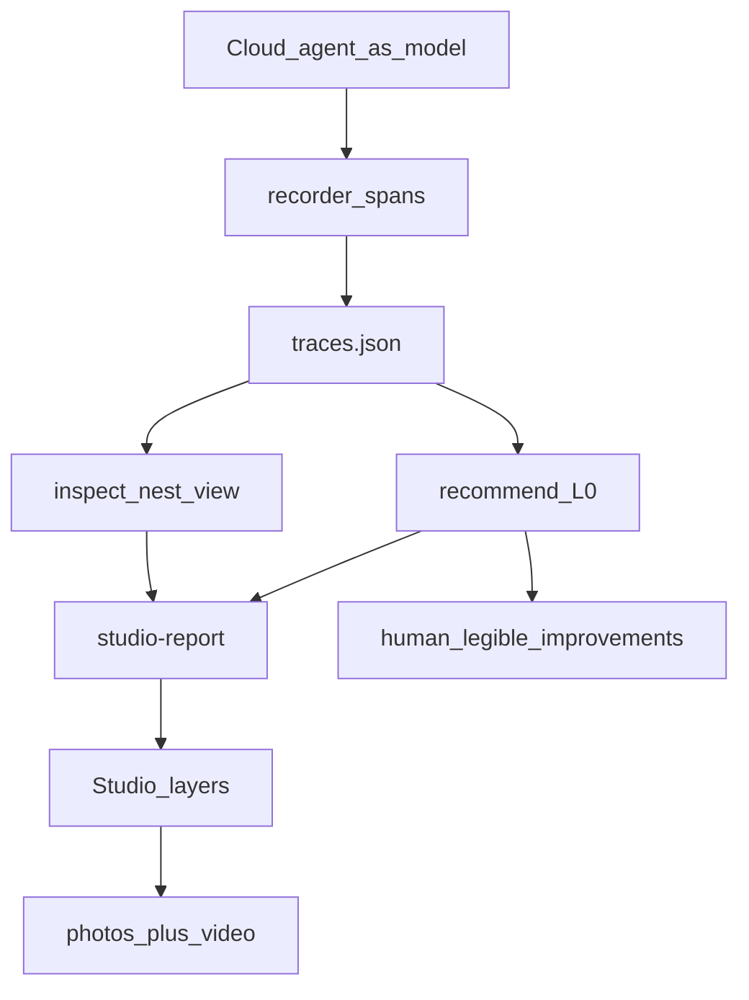
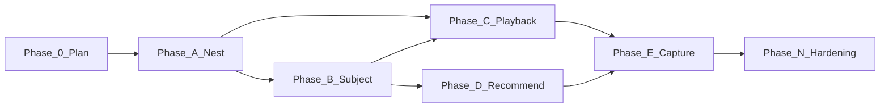

# Layered multi-agent Studio — Master Execution Plan

> Nawab master plan — feature-mode execution contract for hierarchical graphs,
> agent-as-model traces, layer photos, and drill-down simulation video.
> **Mode:** feature
> After approval, this file is the authority for the run; `IMPLEMENTATION_PLAN.md`
> gets a pointer. Do not start product code until § Approval is signed.

---

## §0 Plan metadata

| Field | Value |
|-------|-------|
| **Mode** | feature |
| **Stack** | Python 3.10+ stdlib core (`src/superdeterminism/`); Vite + React + TypeScript Studio (`ui/`); optional `[langgraph]` extra only if a LangGraph supervisor harness is chosen (default: **no**) |
| **Base branch** | `main` |
| **Feature branch** | `cursor/layered-multiagent-studio-dc73` |
| **Authority docs** | [PROJECT_OVERVIEW.md](../../PROJECT_OVERVIEW.md), [docs/architecture.md](../architecture.md), [docs/methodology.md](../methodology.md), [docs/design/STUDIO_SHAPE.md](../design/STUDIO_SHAPE.md), [docs/decisions/0013-ui-studio-react-flow.md](../decisions/0013-ui-studio-react-flow.md), [docs/decisions/0003-no-auto-apply.md](../decisions/0003-no-auto-apply.md), [docs/decisions/0004-agnostic-core.md](../decisions/0004-agnostic-core.md), this file |
| **Estimated commits** | **12–14** (major demo + core nest + Studio playback; not a new package) |
| **Lead agent** | Orchestrate, implement, commit, integrate, PR; **is also the subject model** (agent-as-model) |

---

## §1 North star & scope boundary

### Objective

When this plan is complete, Unagent Studio shows a **three-layer** architecture graph (orchestrator → specialist agents → tools / MCP / skills), captured as **one photo per layer**, and a **simulation video** that starts on the orchestrator canvas, follows a task into an agent, and plays tools inside that agent — all from **multi-run traces produced by this Cursor cloud agent acting as the model**, then a human-legible architecture-improvement note grounded in L0 advice.

### Deliverables

- Core nest: `inspect` / `studio-report` emit `children` + `subgraph` from existing `parent` edges (Studio already drills; the wire format is empty today)
- Advisor-owned surface tags on nodes: `advisor.surface` ∈ `{native_tool, mcp, skill}` — **no new `gen_ai.*` keys**, no new `node_kind` enum values
- Studio playback **follows hierarchy**: when the active event’s `node_id` is not on the current frame, auto-enter / pop breadcrumbs
- In-repo subject `demos/e2e-layered/`: supervisor topology + agent-as-model recorder + assembled `traces.json` + `studio_report.json`
- Layer stills (L0 / L1×agents / L2 tools) + one drill-down simulation video
- Report `docs/reports/E2E_LAYERED_STUDIO.md` with advisor table + **human-legible “how to improve”**
- Regression tests: nest serializer, playback follow, demo pipeline smoke

### Non-goals

- Cloning Magentic-One / CrewAI / AutoGen as a git submodule (optics without MCP/skill layers; paid APIs)
- Replacing `FakeMessagesListChatModel` in `demos/e2e-langgraph/` (that demo stays)
- New `node_kind` values (`mcp`, `skill`) — maps already send MCP `tools/call` → `deterministic_tool`
- Changing L0 decision rules, Wilson thresholds, or FlipToDet fail-closed behavior
- Auto-apply, in-place `graph.py` rewrite, live production-LLM re-runs, L1/L2
- Inventing `gen_ai.agent.handoff.*` or other Development-spec keys
- Full Studio redesign (impeccable pass only if layer chrome is unreadable)
- Forty identical calculator clones — agent-as-model is **distinct tasks**, not cassette padding

### Priority

| Priority | Items |
|----------|-------|
| **P0** | Nest export; playback follow; agent-as-model traces (n≥8 distinct runs); L0/L1/L2 photos; drill-down video; recommend + human-legible improvements |
| **P1** | Layer caption chip; per-agent L1 stills beyond the two busiest agents; narrative stdout for the layered report |

---

## §2 Prerequisites & blockers

| Item | Status | Blocks | Resolution |
|------|--------|--------|------------|
| Plan approval | pending | Phase A+ | User approves this document (and defaults in Open questions) |
| Studio hierarchy UI | done | — | Breadcrumbs + `ENTER_SUBGRAPH` already in `ui/` |
| Flat reconstruct | done | nest export | `reconstruct()` already emits `parent` edges; nest is a **view** |
| Agent-patterns MCP | unavailable this run | §11 citations | Fallback: `agentic-system-design` skill; catalog ids named from skill vocabulary |
| Paid chat APIs | N/A | — | Agent-as-model = this cloud agent; no OpenAI/Anthropic keys |
| Walkthrough recorder | done | Phase E | `RecordScreen` + `computerUse` after Studio serves the report |

**Hard rule:** Phase A does not start while “Plan approval” is `pending`.

---

## §3 Authority & artifact map

| Document | Path | Role |
|----------|------|------|
| This plan | `docs/plans/layered-multiagent-studio.md` | **Writable** execution contract |
| Architecture | `docs/architecture.md` | **Read-only** node_kind / det.class / mapping |
| Methodology | `docs/methodology.md` | **Read-only** L0 vs observational; simulation ≠ production |
| Studio shape | `docs/design/STUDIO_SHAPE.md` | **Read-only** hierarchy + playback contract |
| ADR 0003 / 0004 / 0013 | `docs/decisions/` | **Read-only** no auto-apply; agnostic core; Studio stack |
| IMPLEMENTATION_PLAN | root | Pointer after approval — do not erase viral-hardening history |
| PROGRESS | root | **Writable** after approval |
| DECISIONS / new ADR | `docs/decisions/0015-*.md` | Nest-as-view + `advisor.surface` |
| Layered demo | `demos/e2e-layered/` | **Writable** traces, report, harness |
| Evidence pack | `docs/reports/E2E_LAYERED_STUDIO.md` + `docs/assets/e2e-layered/` | **Writable** Phase E |
| Spec Kit `.specify/` | existing 001-product-hardening | **Read-only** — do not start a second spec-kit feature unless approval says so |

Subagents: explore/review are read-only. `computerUse` may drive the browser; it does not commit.

---

## §4 Architecture & system map

### Agentic System Design Note (required)

**Autonomy:** human checkpoint = this plan’s approval + no mutating tools in the subject (no write/delete/pay/send). Orchestrator has a **hard step budget** (max 12 spans per run). I (lead cloud agent) am the model for every specialist node.

**Catalog vocabulary** (Agent Patterns MCP was not connected; skill fallback):

| Layer | Pattern | Role |
|-------|---------|------|
| L0 | Orchestrator–workers / supervisor | Assign, budget, join |
| L0 | Handoff | `transfer_to_*` / `advisor.handoff` as `EdgeKind.HANDOFF` |
| L1 | Tool use | Narrow schemas, idempotent reads |
| L1 | Skills-as-playbooks | Deterministic procedure cards, not LLMs |
| L1 | MCP tool host | External tool surface; same `execute_tool` mapping |
| All | Fail-closed / ABSTAIN | Unknown / mixed / diverged |

**Tool contracts (subject):**

| Surface | Examples | Idempotent | Side effects |
|---------|----------|------------|--------------|
| native_tool | `Read`, `Grep`, `Glob` | yes | no |
| mcp | `cursor-cloud.run-info` (or refuse-with-reason if down) | yes | no |
| skill | `ponytail` ladder check, `nawab-plans` section check | yes | no |

**Context:** in-context only; no persistent memory store. Each run is one scenario file.

**Model per step:** one model — this cloud agent. Do not pretend temperature-0 hosted APIs.

**Eval set:** ≥8 distinct scenarios in `demos/e2e-layered/scenarios/` (happy, edge, abstain-forcing, adversarial “please rewrite graph.py”). Not 20 LLM evals — this is architecture evidence, not a product agent.

**Cost/latency:** N/A for hosted tokens; record `latency_ms` as wall time of my tool calls.

### Subject topology (L0 / L1 / L2)

```text
L0  workflow:orchestrator
      ├─ router:intake                 # schema-stable JSON → FlipToDet candidate
      ├─ subagent:research_agent
      ├─ subagent:implement_agent      # advise-only; no file writes in subject
      ├─ subagent:review_agent
      └─ llm_reasoner:synthesize       # I join findings → ABSTAIN expected

L1  research_agent
      ├─ llm_reasoner:research_reasoner
      ├─ deterministic_tool:repo_grep     advisor.surface=native_tool
      ├─ retriever:docs_read              advisor.surface=native_tool
      └─ deterministic_tool:ponytail_check advisor.surface=skill

L1  implement_agent
      ├─ llm_reasoner:implement_reasoner
      ├─ deterministic_tool:read_source   advisor.surface=native_tool
      └─ deterministic_tool:mcp_run_info  advisor.surface=mcp

L1  review_agent
      ├─ llm_reasoner:review_reasoner
      ├─ deterministic_tool:claim_hygiene advisor.surface=skill
      └─ deterministic_tool:test_inventory advisor.surface=native_tool
```

This is the architecture.md “LangGraph ReAct + subgraph” example, expanded with MCP/skill **surfaces**, executed by me instead of `FakeMessagesListChatModel`.

### Product data flow



### Target layout

```text
demos/e2e-layered/
  README.md
  SUBJECT.md                 # topology + claim hygiene
  scenarios/*.md             # ≥8 distinct tasks
  record_run.py              # validate/assemble spans → traces
  traces.json                # committed cassette
  studio_report.json
  run_pipeline.sh
tests/test_graph_nest.py
tests/test_e2e_layered_demo.py
ui/src/state/playback.ts     # follow-hierarchy helper
docs/decisions/0015-hierarchical-studio-view.md
docs/reports/E2E_LAYERED_STUDIO.md
docs/assets/e2e-layered/
```

### Trust boundaries

- Subject tools are **read-only**. Adversarial scenario that asks to rewrite agent source must **refuse** and emit a policy span (`policy_ok=0` or ABSTAIN path).
- Trace bodies may omit message text (privacy by default). Node names and schemas stay.
- Studio proposals remain export-only (ADR 0003).
- Core still has zero LangChain / LangGraph imports.

### Frontend Architecture Note (Studio)

| Concern | Choice |
|---------|--------|
| Rendering | Keep CSR Vite SPA — no Next.js |
| State | Keep `studioReducer`; add `FOLLOW_NODE` (or fold into tick/step) |
| Data | Report JSON only; no new fetch layer |
| Styling | Existing tokens; optional “Layer N · …” caption on breadcrumbs |
| Anti-pattern | Do not rebuild GraphCanvas; do not add a global store |

---

## §5 Workstreams

| ID | Name | Owns paths | Depends on | Lead / subagent |
|----|------|------------|------------|-----------------|
| WS-A | Nest view | `src/superdeterminism/graph.py` or new `nest.py`, `pipeline.py` inspect, `cli.py` studio-report, `tests/test_graph_nest.py` | approval | lead |
| WS-B | Agent-as-model subject | `demos/e2e-layered/**`, `tests/test_e2e_layered_demo.py` | WS-A nest contract (can stub JSON first) | lead (I am the model) |
| WS-C | Studio follow | `ui/src/state/*`, optional caption CSS | WS-A sample report with children | lead |
| WS-D | Evidence pack | `docs/reports/*`, `docs/assets/e2e-layered/*`, `docs/decisions/0015-*` | WS-B traces + WS-C UI | lead + `computerUse` |

### WS-A — Nest view

- **Objective:** Parent forest → Studio `children` / `subgraph` without changing recommender identity.
- **Phases:** A
- **Integration:** `studio-report` `graph` object; recommend stays flat.

### WS-B — Agent-as-model subject

- **Objective:** I execute ≥8 scenarios; recorder writes hierarchical spans; pipeline is replayable in CI from committed traces.
- **Phases:** B
- **Integration:** traces feed WS-A nest + WS-D report.

### WS-C — Studio follow

- **Objective:** Playback auto-drills so the video can start at L0 and enter agents.
- **Phases:** C
- **Integration:** loads WS-B `studio_report.json`.

### WS-D — Evidence pack

- **Objective:** Layer photos, one video, human-legible improvements.
- **Phases:** D, E, N
- **Integration:** PR body + `docs/reports/E2E_LAYERED_STUDIO.md`.

---

## §6 Agent orchestration & subagent spawn map

> See `.cursor/skills/nawab-plans/SUBAGENT_ORCHESTRATION.md`.

| ID | Trigger | Type | readonly | Task | Sync point | Gate |
|----|---------|------|----------|------|------------|------|
| S1 | Phase A start | explore | true | Confirm all callers of `inspect_traces` / `reconstruct` | Before nest commit | — |
| S2 | Phase E | computerUse | true | Layer stills + drill-down video | After Studio serves report | artifacts on disk |
| S3 | Phase N | explore | true | Adjacent tests missing for nest + playback | Hardening | — |

**Do not spawn** `generalPurpose` writers — one package, overlapping files, lead implements.

### Spawn S1 — inspect/reconstruct callers

```text
Full Repository Path: /workspace
Workstream: WS-A
Task: List every caller of reconstruct() and inspect_traces(); note whether they assume a flat node list
Authority: docs/architecture.md, this plan §4
Return: bullet list of paths + whether nest-as-view can stay out of ArchitectureGraph
Do NOT: edit files, expand scope
```

### Spawn S2 — Studio capture

```text
Full Repository Path: /workspace
Workstream: WS-D
Task: Open Studio on layered studio_report; capture L0, two L1 agent frames, one L2 tools frame; play simulation from L0 into an agent
Authority: docs/design/STUDIO_SHAPE.md, walkthrough-artifacts skill
Return: screenshot paths + whether playback auto-entered
Do NOT: commit, change product files
```

**Parallel limit:** 2  
**File ownership:** lead owns all `src/`, `ui/`, `demos/e2e-layered/`. Subagents do not write.

**Lead retains:** git, PR, PROGRESS, integrating spawn output.

---

## §7 Phase map & dependencies



| Phase | Objective | Workstreams | Commits | Depends on | Exit gate |
|-------|-----------|-------------|---------|------------|-----------|
| 0 | This plan approved | all | 1 (docs) | — | User approval |
| A | Nest parent forest into Studio graph | WS-A | 2–3 | 0 | `pytest tests/test_graph_nest.py` |
| B | Agent-as-model scenarios + traces | WS-B | 3–4 | 0 (A contract) | `pytest tests/test_e2e_layered_demo.py` + traces exist |
| C | Playback FOLLOW_NODE | WS-C | 2 | A + sample nested report | `cd ui && npm test` |
| D | Recommend + human-legible note | WS-D | 2 | B | `recommend` / `studio-report` exit 0 |
| E | Photos + video | WS-D | 1 | C + D | artifacts + report images |
| N | Hardening | all | 1–2 | E | `./scripts/validate.sh` (or scoped pytest + ui test if validate is too wide) |
| Cutover | N/A | — | — | — | demo + docs only |

---

## §8 Todo registry

```yaml
todos:
  - id: phase-0-approval
    content: "Phase 0: user approves this nawab plan and defaults"
    status: pending
  - id: subagent-s1-callers
    content: "Spawn S1: map reconstruct/inspect callers"
    status: pending
  - id: phase-a-nest
    content: "Phase A: nest-as-view + studio-report children/subgraph"
    status: pending
  - id: phase-b-scenarios
    content: "Phase B: write ≥8 scenarios and record agent-as-model traces"
    status: pending
  - id: phase-c-follow
    content: "Phase C: Studio playback follows hierarchy"
    status: pending
  - id: phase-d-recommend
    content: "Phase D: L0 recommend + human-legible improvements"
    status: pending
  - id: subagent-s2-capture
    content: "Spawn S2: layer photos + drill-down video"
    status: pending
  - id: phase-e-report
    content: "Phase E: E2E_LAYERED_STUDIO.md + assets"
    status: pending
  - id: phase-n-hardening
    content: "Phase N: adjacent tests + validate + ponytail-review"
    status: pending
```

---

## §9 Commit matrix

> One row = one commit. Work class: **major backend + UI + demo** → **12–14** rows.

### Phase 0 — Plan (this PR)

| # | WS | Commit | Contents | Tests | Gate | Agent |
|---|-----|--------|----------|-------|------|-------|
| 1 | — | `docs(plan): layered multi-agent Studio nawab contract` | this file | — | file exists, §0–§18 present | lead |

### Phase A — Nest view (WS-A)

| # | WS | Commit | Contents | Tests (same commit) | Gate | Agent |
|---|-----|--------|----------|---------------------|------|-------|
| 2 | A | `docs(adr): hierarchical Studio view is a nest of parent edges` | `docs/decisions/0015-hierarchical-studio-view.md` | — | ADR lists identity-stable / recommend-flat | lead |
| 3 | A | `feat(graph): nest parent forest into children and subgraph` | `nest.py` or `graph.nest_for_studio`; `inspect_traces` / `studio-report` emit nested graph + `advisor.surface` | `tests/test_graph_nest.py` | `pytest tests/test_graph_nest.py tests/test_graph.py` | lead |

**Phase A gate:** nest tests green; flat `ArchitectureGraph.identity` unchanged for the same node/edge set.

### Phase B — Agent-as-model subject (WS-B)

| # | WS | Commit | Contents | Tests (same commit) | Gate | Agent |
|---|-----|--------|----------|---------------------|------|-------|
| 4 | B | `chore(demo): scaffold e2e-layered subject and scenarios` | `demos/e2e-layered/{README,SUBJECT,scenarios,record_run.py}` | assembler self-check on a tiny fixture | `python demos/e2e-layered/record_run.py --check-fixture` | lead |
| 5 | B | `feat(demo): record agent-as-model hierarchical traces` | `traces.json` from ≥8 live runs I execute | span parent tree matches SUBJECT.md | traces load via `inspect` | lead |
| 6 | B | `test(demo): layered pipeline regression` | `tests/test_e2e_layered_demo.py` + `run_pipeline.sh` | pytest | `pytest tests/test_e2e_layered_demo.py` | lead |

**Phase B gate:** `python -m superdeterminism inspect` (or studio-report) sees ≥1 workflow, ≥3 subagents, tools with three surfaces.

### Phase C — Studio follow (WS-C)

| # | WS | Commit | Contents | Tests (same commit) | Gate | Agent |
|---|-----|--------|----------|---------------------|------|-------|
| 7 | C | `feat(ui): playback follows nested node breadcrumbs` | reducer + `FOLLOW_NODE` / tick path | `studioReducer.test.ts` + playback test | `cd ui && npm test` | lead |
| 8 | C | `feat(ui): layer caption on hierarchy breadcrumbs` | “Layer 0 · Orchestrator” etc. | reducer or component assertion | `cd ui && npm test` | lead |

**Phase C gate:** given a nested report, stepping an event inside `research_agent` enters that frame.

### Phase D — Recommend & prose (WS-D)

| # | WS | Commit | Contents | Tests (same commit) | Gate | Agent |
|---|-----|--------|----------|---------------------|------|-------|
| 9 | D | `feat(demo): layered studio-report from agent-as-model traces` | `studio_report.json`, pipeline script wired | demo test still green | `./demos/e2e-layered/run_pipeline.sh` | lead |
| 10 | D | `docs(report): human-legible architecture improvements` | draft `E2E_LAYERED_STUDIO.md` sections 1–7 (no media yet) | — | recommendations table matches JSON | lead |

### Phase E — Capture (WS-D)

| # | WS | Commit | Contents | Tests | Gate | Agent |
|---|-----|--------|----------|-------|------|-------|
| 11 | D | `docs(report): layered Studio stills and simulation video` | `docs/assets/e2e-layered/*` + report media | — | L0 + ≥2 L1 + ≥1 L2 stills; 1 mp4 | lead + S2 |

### Phase N — Validation

| # | WS | Commit | Contents | Tests (same commit) | Gate | Agent |
|---|-----|--------|----------|---------------------|------|-------|
| 12 | all | `test: harden nest, playback follow, and layered demo` | gap tests from S3 | pytest + ui | scoped commands below | lead |
| 13 | all | `docs: PROGRESS and LEARNING for layered Studio` | PROGRESS, LEARNING, IMPLEMENTATION_PLAN pointer | — | files updated | lead |

**Commit contract:** one matrix row per commit; no squash of nest + demo + UI.

---

## §10 Test & CI strategy

| Tier | Purpose | Trigger | Command |
|------|---------|---------|---------|
| Fast | nest + graph + ui reducer | every PR | `pytest tests/test_graph_nest.py tests/test_graph.py tests/test_e2e_layered_demo.py` · `cd ui && npm test` |
| Medium | full Python suite | PR | `pytest` |
| Slow | validate script + Studio smoke | Phase N / main | `./scripts/validate.sh` if it stays green; else document skip reason |

### CI workflow map

| Job | Trigger | Command |
|-----|---------|---------|
| Existing CI | PR / main | unchanged; new tests must be picked up by default pytest / ui job |

**Test locations:** `tests/test_graph_nest.py` (pure nest); `tests/test_e2e_layered_demo.py` (committed traces); `ui/src/state/*.test.ts` (follow + caption).

**Contract-first:** commit 3 (nest tests + impl) before commit 5 (live traces). Commit 7 tests before relying on video.

**Subagents:** S1/S3 return findings only. S2 returns artifact paths.

---

## §11 Research log & decisions

| Topic | Options | Choice | Source / skill | Record in |
|-------|---------|--------|----------------|-----------|
| Subject repo | A clone Magentic-One/CrewAI · B instrument a random complex app · C in-repo supervisor + **this agent as model** | **C** | User: “you are the agent for testing”; `agentic-system-design`; ponytail YAGNI (no extra framework extra) | ADR 0015 + SUBJECT.md |
| Hierarchy source | A change `ArchitectureGraph` · B nest-as-view at inspect/studio-report | **B** | Studio already reads `children`/`subgraph`; identity hash must stay flat (`graph.py`) | ADR 0015 |
| MCP/skill types | A new `node_kind` · B `advisor.surface` on existing kinds | **B** | [architecture.md](../architecture.md) MCP→`execute_tool`; constitution V no invented `gen_ai.*` | ADR 0015 |
| Model | A `FakeMessagesListChatModel` · B hosted API · C **cloud agent as model** | **C** | User request; methodology residual nondeterminism — do not claim bit-exact | SUBJECT.md |
| Sample size | A n=40 clones · B n≥8 distinct live runs, `--n-min 1` | **B** | Wilson n=30 needs clones; clones would lie about agent-as-model | report claim hygiene |
| Playback | A operator clicks into agents · B auto-follow active `node_id` | **B** | User asked video: orchestrator → assign → inside agent | STUDIO_SHAPE addendum |
| Patterns MCP | Live catalog vs skill fallback | **Skill fallback** (MCP not in namespace catalog this run) | `agentic-system-design` | this §11 |

### Trade-off: subject

**Decision:** What architecture we ingest.

**Option A:** Famous OSS multi-agent repo — Pros: recognizable. Cons: no first-class skills/MCP; FakeChat or API keys; P1 extra; still a flat reconstruct unless we nest anyway.

**Option B:** Nest-only on the existing 3-node LangGraph demo — Pros: tiny. Cons: user already rejected it as too simple.

**Option C:** In-repo supervisor whose model is **this** cloud agent — Pros: real tools/MCP/skills; matches “agent as model”; no new dependency. Cons: not a third-party GitHub star count.

**Default:** C because the request is layer photos + MCP/skills + I am the tester.

**Override:** Set PRIORITY = RECOGNIZABILITY to force Option A after approval.

### Trade-off: nest vs core graph

**Decision:** Where hierarchy lives.

**Option A:** Add `children` to `GraphNode` / identity — Pros: one model. Cons: identity churn, recommender coupling, bigger diff.

**Option B:** Nest only in inspect/studio JSON — Pros: recommend/identity unchanged; Studio already works. Cons: two shapes (flat decide, nested view).

**Default:** B (ponytail). Upgrade if a second consumer needs nest.

### Trade-off: n and FlipToDet

**Decision:** How many agent-as-model runs.

**Option A:** 40 identical scripted clones — Pros: Wilson default. Cons: not agent-as-model; repeats the current demo’s sin.

**Option B:** ≥8 distinct live runs, `--n-min 1`, honest ABSTAIN on reasoners — Pros: real variance. Cons: few FlipToDet certificates.

**Default:** B. Intake router may still FlipToDet if I emit the same schema every run.

---

## §12 Documentation & artifact sync

| Event | Update |
|-------|--------|
| Plan approved | Pointer in `IMPLEMENTATION_PLAN.md`; `PROGRESS.md` phase table |
| Phase complete | `PROGRESS.md`; optional `PHASE_*` only if a phase surprises the plan |
| Arch decision | `docs/decisions/0015-hierarchical-studio-view.md`; `DECISIONS.md` index |
| Demo shipped | `demos/e2e-layered/README.md`; `docs/ui.md` one paragraph; report |
| Cutover | N/A |

---

## §13 Quality gates & checkpoints

| Gate | When | Command / checklist | Blocks |
|------|------|---------------------|--------|
| Plan approved | end 0 | user reply | Phase A |
| Nest correct | end A | `pytest tests/test_graph_nest.py tests/test_graph.py` | Phase C sample; Phase B inspect |
| Traces hierarchical | end B | inspect shows workflow + ≥3 subagents + 3 surfaces | Phase D |
| Playback follow | end C | `cd ui && npm test` | Phase E video |
| Advisor honest | end D | report JSON: reasoners ABSTAIN or observational; no invented gen_ai | Phase E prose freeze |
| Evidence pack | end E | L0 + ≥2 L1 + ≥1 L2 stills; 1 video; improvements ≥5 bullets | Phase N |
| Hardening | end N | scoped pytest + ui test; ponytail-review on diff | PR ready |

### Human checkpoints

- [ ] **Approve this plan** (and defaults: subject C, nest-as-view, n≥8, `--n-min 1`)
- [ ] Optional: override subject to a named OSS repo
- [ ] PyPI / marketing GIFs remain user-owned (same as viral plan)

---

## §14 Validation & hardening

### Repo walkthrough

1. Static: no new `gen_ai.*`; no secrets; subject tools read-only
2. Fast → medium tests in §10
3. Adjacent: `tests/test_replay.py`, existing e2e-langgraph demo still green
4. `ponytail-review` on the branch diff (lead, not a new abstraction)
5. speckit-converge: N/A — no new `.specify/` feature
6. Add regressions for any nest/follow bugs found in capture
7. Manual: Studio empty/error/load still work with flat reports (old `examples/studio_report.json`)

### Orchestrator

Prefer existing `scripts/validate.sh`. If it fails for unrelated reasons, Phase N records the skip and runs:

```text
1. pytest tests/test_graph.py tests/test_graph_nest.py tests/test_e2e_layered_demo.py tests/test_e2e_langgraph_demo.py
2. cd ui && npm test
3. python -m superdeterminism studio-report demos/e2e-layered/traces.json --n-min 1 --out /tmp/layered.json
```

---

## §15 Rollout & cutover

N/A — no consumer switch. Demo + docs only. Old `demos/e2e-langgraph/` remains the LangGraph cassette demo.

Rollback: revert the feature branch; Studio without `children` stays valid.

---

## §16 Exit criteria

### P0 (must pass)

- [ ] `studio-report` graph has a root workflow and drillable subagents (`children` or `subgraph` non-empty)
- [ ] At least one node tagged `advisor.surface=mcp` and one `=skill` and one `=native_tool`
- [ ] ≥8 distinct agent-as-model traces committed; I (lead) produced the decisions
- [ ] Playback test: event on a child node auto-enters that agent frame
- [ ] Photos: L0 orchestrator, ≥2 agent interiors, ≥1 tools/MCP/skills layer
- [ ] One video: L0 → assignment → inside-agent tool playback
- [ ] `docs/reports/E2E_LAYERED_STUDIO.md` has advisor table + ≥5 human-legible improvement points grounded in that table
- [ ] Claim hygiene: simulation ≠ production; no “nobody does counterfactual simulation”
- [ ] Existing LangGraph e2e demo still passes
- [ ] Draft PR with evidence

### P1 (defer ok)

- [ ] Layer caption chrome
- [ ] Stills for every agent (not only the two busiest)
- [ ] `--stdout narrative` for the layered report

---

## §17 Risks & contingencies

| Risk | Likelihood | Impact | Mitigation | Contingency |
|------|------------|--------|------------|-------------|
| Flat recommend + nested view diverge | med | med | Nest is a pure function of parent edges; golden test | Document mismatch; do not nest in identity |
| Agent-as-model traces too unique → all ABSTAIN | high | low | Expected for reasoners; intake schema can FlipToDet | Improvements still valid from ABSTAIN reasons |
| MCP down | med | low | Record refuse-with-reason span; still tag surface=mcp | Drop MCP still; keep skill + native |
| Playback follow fights user drill | med | med | Follow only while playing; pause = manual breadcrumbs | Video operator clicks if follow flakes |
| Scope creep into new node_kind | med | high | Non-goals; ponytail | Reject in review |
| I mutate the repo while “testing” | med | high | Subject tools read-only; adversarial scenario must refuse | Reset files; do not commit subject side effects |
| Validate.sh red for unrelated reasons | low | med | Scoped gate in §14 | Note in Phase N |

---

## §18 Execution protocol

```text
1. Load this plan + nawab-plans; ponytail on every edit
2. Do not start Phase A until §13 plan approval
3. Phase 0 done = this file on the feature branch (commit 1)
4. For each later phase in §7:
   a. Sync §8 todos (one in_progress)
   b. Spawn S1 at Phase A start; S2 at Phase E; S3 at Phase N
   c. For each §9 row: implement → test → gate → commit → push
      (cloud run: push each working commit; one row per commit)
   d. I execute Phase B scenarios myself (agent-as-model) — no FakeChat
   e. Phase gate → PROGRESS.md
   f. Human checkpoint only if user changes subject/n defaults
5. Phase N: §14 walkthrough + ponytail-review
6. Verify §16 P0 → mark PR ready
```

---

## Open questions

Answer these by approving the **defaults** or naming an override:

1. **Subject:** Default **C** (in-repo supervisor, I am the model). Override to a named OSS repo if you want star-count optics.
2. **n:** Default **≥8 distinct live runs**, `--n-min 1`. Override if you want cloned n=30 Wilson theatre.
3. **Nest:** Default **view-only** (recommend stays flat). Override if you want `ArchitectureGraph` to own children.
4. **Surfaces:** Default `advisor.surface` only. Override if you insist on new `node_kind` values (schema bump).

## Approval

**Mode:** feature  
Plan ready for review. Approve to begin **Phase A** (nest-as-view).  
Lead agent follows **§18 Execution protocol**.

If you reply **approve** (or “approve defaults”), execution starts at commit 2.  
If you name an override (subject / n / nest / surfaces), the plan is revised in one commit before Phase A.
