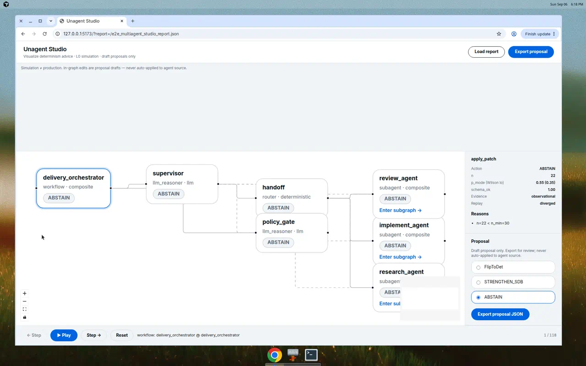
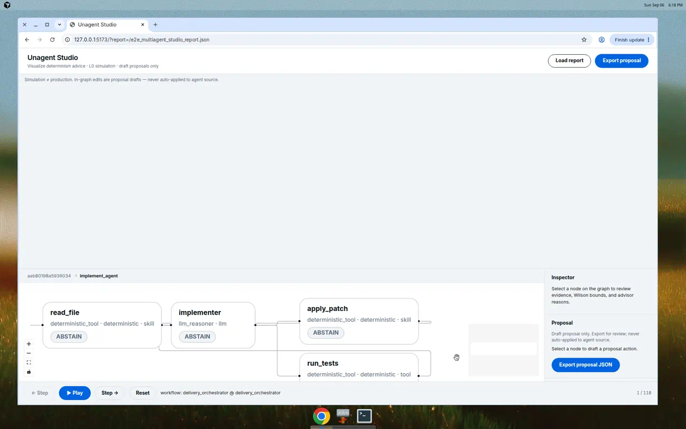

# E2E report — Delivery orchestrator × Unagent Studio

**Date:** 2026-09-06  
**Operator:** Cursor cloud agent (this run) — **agent-as-model**  
**Product:** Unagent (`superdeterminism`) + Unagent Studio (`ui/`)  
**Subject:** LangGraph supervisor + three specialist subgraphs + policy gate  
**Artifacts:** [demos/e2e-multiagent/](../../demos/e2e-multiagent/) · media in [docs/assets/e2e-multiagent/](../assets/e2e-multiagent/) · plan [layered-multiagent-e2e.md](../plans/layered-multiagent-e2e.md)

> Simulation ≠ production. Scaffold patches are illustrative and never auto-applied.

## 1. Objective

The previous Studio E2E was a flat three-node line (`guard_input → model ⇄ calculator`). This run uses a **layered** graph:

1. Orchestrator with specialist agents underneath.
2. Open each agent to see tools, MCP, and skills.
3. Play a simulation that starts on the orchestration screen, assigns a task, then continues **inside** the agent.
4. Ingest **42** traces I produced by acting as the model.
5. Recommend, then write human-legible improvements.

## 2. Subject architecture

```text
Layer 0  delivery_orchestrator
           supervisor ──handoff──► research_agent
                     ──handoff──► implement_agent
                     ──handoff──► review_agent
                     ───────────► policy_gate

Layer 1  research_agent    researcher · web_search (mcp) · retrieve_docs (mcp) · cite_sources
         implement_agent   implementer · read_file (skill) · apply_patch (skill) · run_tests
         review_agent      reviewer · lint · security_scan
```

I authored every route and tool I/O blob (D22). The harness replays those cassettes through real LangGraph `StateGraph` + `ToolNode` + compiled subgraphs. No paid API.

Scenarios: `research_query` (15) · `implement_constant` (12) · `full_delivery` (10) · `policy_block` (5).

## 3. Method

```bash
pip install -e ".[dev,langgraph]"
./demos/e2e-multiagent/run_pipeline.sh
cd ui && npm install && npm run dev
# http://127.0.0.1:5173/?report=/e2e_multiagent_studio_report.json
```

`studio-report` attaches `nest_for_studio` (D21): reconstruct stays flat for identity / L0; Studio sees subgraphs.

## 4. Layers (Studio)







## 5. Simulation playback

<video src="../assets/e2e-multiagent/orchestration_to_agent.mp4" controls></video>

Playback starts at `delivery_orchestrator` → `supervisor` → `handoff` → `research_agent`, then Studio **enters** the research subgraph (`researcher`, `web_search`, …).

## 6. Advisor recommendations

From `demos/e2e-multiagent/report.json` after stabilizing `policy_gate` to `{allow, reason_code}`:

| Node | Action | n | p_mode | Wilson lo | Replay |
|------|--------|---|--------|-----------|--------|
| `policy_gate` | ABSTAIN | 42 | 0.88 | 0.75 | diverged |
| `supervisor` | ABSTAIN | 42 | 0.36 | 0.23 | diverged |
| Specialists | ABSTAIN | 22–25 | — | n < 30 or tool-then-answer | — |

**Why no FlipToDet:** mixed orchestrator traffic. The gate still denies spend tasks. Inner agents never reach `n_min=30`. That is correct fail-closed behavior.

First cassette (free-text policy reasons) had `policy_gate` p_mode **0.36**. Codes alone lifted it to **0.88** — still not enough for a certified flip.

## 7. How to improve

See [demos/e2e-multiagent/IMPROVEMENTS.md](../../demos/e2e-multiagent/IMPROVEMENTS.md). Short version:

1. Replace `policy_gate` with a deterministic spend/HITL function.
2. Split supervisor into intent classifier + handoff table.
3. Sample specialists to n≥30 before flipping them.
4. Split plan vs commit spans on each specialist LLM.
5. STRENGTHEN `apply_patch` with a human checkpoint.
6. Keep MCP retrievers and skills in their current determinism class.

## 8. Claim hygiene

- Executed LangGraph invokes; I/O authored by this agent, not a hosted LLM.
- Evidence ceiling observational / cassette L0 — not live L1.
- Unagent never rewrote a subject `graph.py`.
- Studio proposal toggles are drafts; export only.

## 9. Reproduce

[demos/e2e-multiagent/README.md](../../demos/e2e-multiagent/README.md). Regression: `pytest tests/test_e2e_multiagent_demo.py`.
