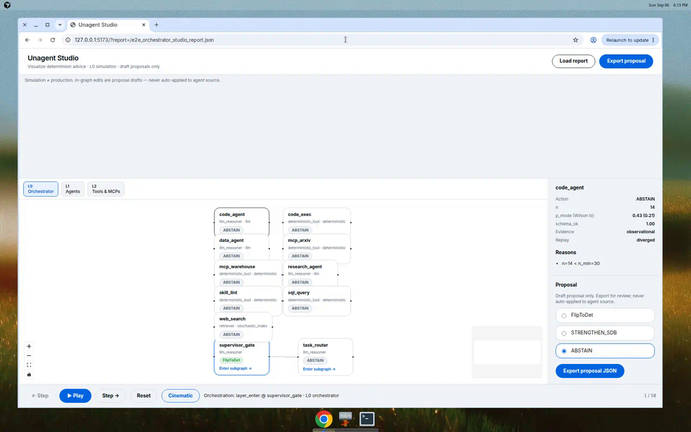
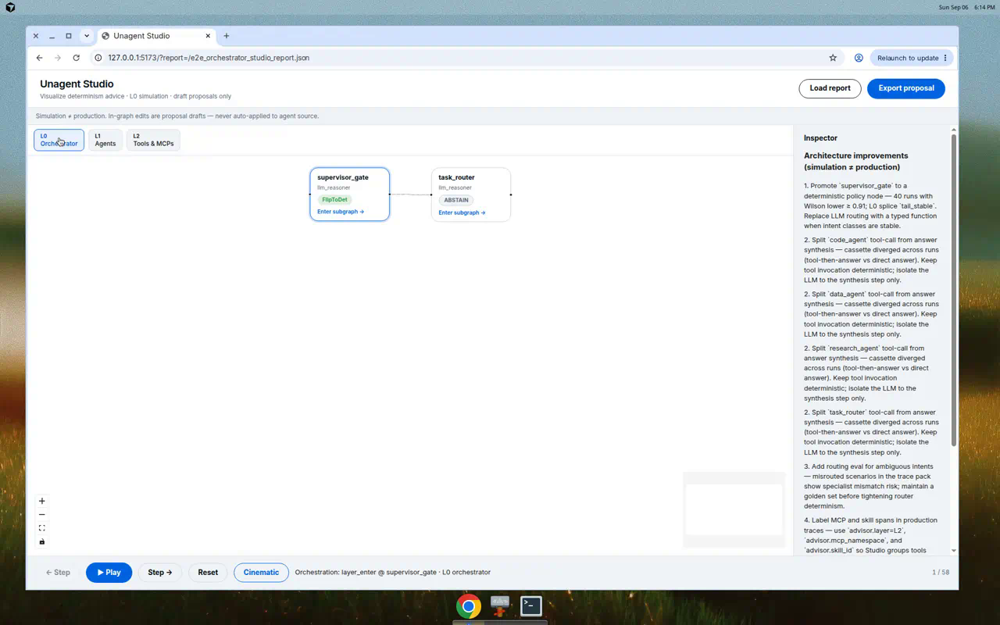

# E2E report — Multi-layer orchestrator × Unagent Studio

**Date:** 2026-09-06  
**Product:** Unagent (`superdeterminism`) + Unagent Studio (`ui/`)  
**Demo:** [`demos/e2e-orchestrator/`](../../demos/e2e-orchestrator/)  
**Artifacts:** media in [`docs/assets/e2e-orchestrator/`](../assets/e2e-orchestrator/)

> Simulation ≠ production. Scaffold patches are illustrative and never auto-applied.

## 1. Objective

Demonstrate a **multi-layer agentic architecture** (orchestrator → specialist agents → tools/MCPs/skills) with:

1. Hierarchical graph in Studio (L0/L1/L2 drill-down)
2. Cinematic simulation playback (orchestration → assignment → in-agent L0 splice)
3. Multi-run trace analysis (n=40) with human-readable improvement bullets
4. Agent-as-model trace pack (scripted cloud-agent scenarios)

## 2. Subject architecture

```text
L0 supervisor_gate → task_router
  ├─ research_agent → web_search | mcp_arxiv | skill_docs
  ├─ code_agent     → code_exec | skill_lint
  └─ data_agent     → sql_query | mcp_warehouse
```

| Layer | Nodes | Role |
|-------|-------|------|
| L0 | `supervisor_gate`, `task_router` | Orchestration shell + intent routing |
| L1 | `research_agent`, `code_agent`, `data_agent` | Specialist subagents |
| L2 | tools, MCPs, skills | Narrow contracts per agent |

## 3. Method

```bash
pip install -e ".[dev]"
bash demos/e2e-orchestrator/run_pipeline.sh
cd ui && npm install && npm run dev
# http://127.0.0.1:5173/?report=/e2e_orchestrator_studio_report.json
```

Agent-as-model traces:

```bash
python demos/e2e-orchestrator/capture_agent_traces.py
```

## 4. Layer views (Studio)

### L0 — Orchestrator



`supervisor_gate` and `task_router` at the root frame. Click **Enter subgraph →** on `task_router` to see specialist agents.

### L1 — Specialist agents


Three agents with handoff edges from the router.

### L2 — Tools, MCPs, skills (research agent drill-down)


### Layer lens control



Use **L0 / L1 / L2** tabs to jump between architecture layers without manual breadcrumb hunting.

## 5. Simulation playback (cinematic)

<video src="../assets/e2e-orchestrator/studio_simulation_cinematic.mp4" controls></video>

Playback phases:

1. **Orchestration** — `layer_enter` on `supervisor_gate`
2. **Task assignment** — `assign_task` from router to specialist
3. **In-agent** — L0 cassette splice inside `research_agent`

Enable **Cinematic** in the playback strip for phase-labelled status.

## 6. Advisor recommendations (n=40)

| Node | Typical action | Notes |
|------|----------------|-------|
| `supervisor_gate` | **FlipToDet** | Identical orchestration JSON every run; tail_stable |
| `task_router` | ABSTAIN | Route varies by scenario; diverged cassette |
| `research_agent` | ABSTAIN | Tool-then-answer vs direct-answer variance |
| L2 tools | ABSTAIN | Already deterministic |

## 7. How to improve this architecture

Studio `narrative` field (also in inspector when no node is selected):

1. **Promote `supervisor_gate` to deterministic** — stable policy shell across all runs.
2. **Split `research_agent` tool-call from synthesis** — cassette diverged on mixed paths.
3. **Add routing eval** for ambiguous intents (planted misroutes in trace pack).
4. **Tag MCP/skill spans** with `advisor.layer=L2` and namespace metadata.
5. **Canary before production** — simulation ≠ production.

## 8. Comparison to flat LangGraph demo

| | `e2e-langgraph` | `e2e-orchestrator` |
|--|-----------------|-------------------|
| Nodes | 3 flat | 11 across 3 layers |
| Drill-down | No nesting | L0→L1→L2 breadcrumbs |
| Playback | Standard L0 | Cinematic phases |
| Primary use | Minimal FlipToDet proof | Architecture review walkthrough |

Both demos remain in the repo; orchestrator is the recommended Studio showcase.
